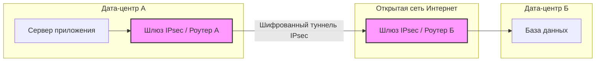
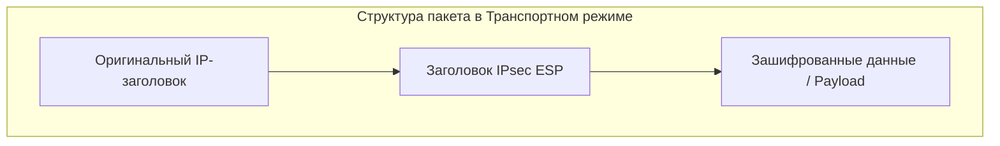
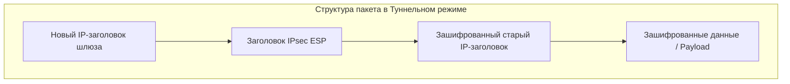
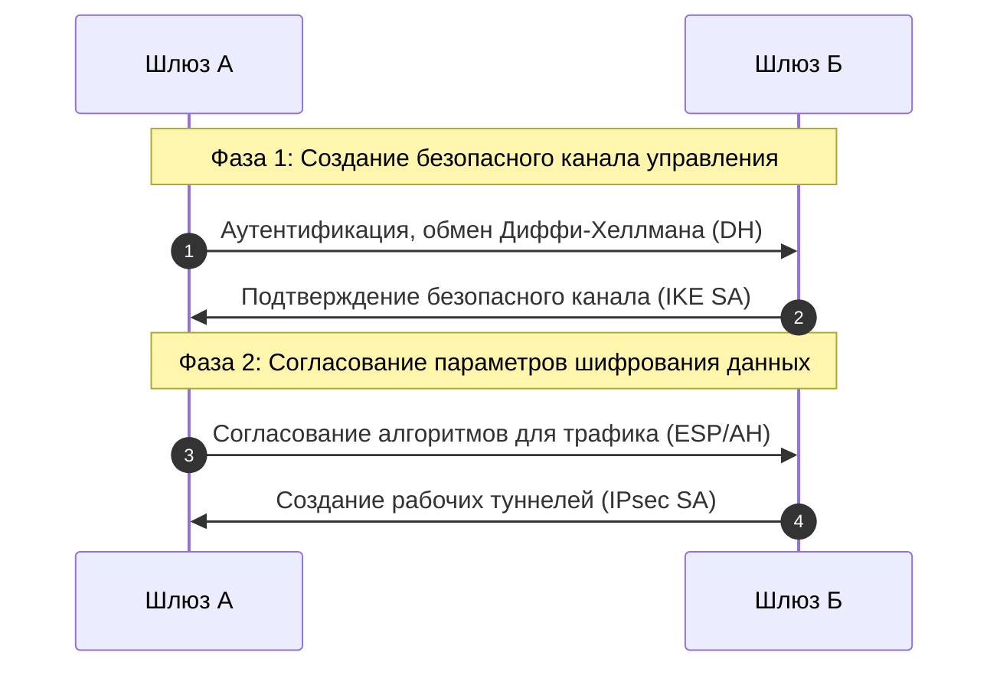

Вот чистый технический конспект по теме **IPsec** для Obsidian. Вместо изображений здесь используются встроенные диаграммы **Mermaid**, которые Obsidian рендерит нативно. Текст написан в строгом профессиональном стиле без использования эмодзи.

---

# IPsec (Internet Protocol Security)

**IPsec** — это набор протоколов для обеспечения безопасности, конфиденциальности и целостности данных на сетевом уровне (**L3 модели OSI**). Он позволяет шифровать и проверять подлинность IP-пакетов, передаваемых по открытым сетям.

> [!abstract] Основное назначение в DevOps
> IPsec чаще всего применяется для построения защищенных корпоративных каналов связи через интернет: **Site-to-Site VPN** (соединение двух изолированных дата-центров или облачных контуров) и **Client-to-Site VPN** (безопасное подключение удаленных сотрудников к внутренней сети компании).

---

## 1. Базовые протоколы IPsec: AH и ESP

IPsec включает в себя два основных протокола, которые определяют, как именно будут обрабатываться сетевые пакеты:

### AH (Authentication Header)

Протокол аутентификации заголовков. Обеспечивает проверку целостности данных (что пакет не изменили по пути) и аутентификацию источника (что пакет пришел именно от доверенного сервера).

* **Ограничение:** **Не шифрует данные**. Полезная нагрузка пакета передается в открытом виде. В современном DevOps практически не используется.

### ESP (Encapsulating Security Payload)

Протокол инкапсуляции зашифрованных данных. Обеспечивает полный спектр защиты: целостность, аутентификацию и **конфиденциальность (полное шифрование данных)**. В продакшене ESP является стандартом по умолчанию.

| Критерий | AH (Authentication Header) | ESP (Encapsulating Security Payload) |
| --- | --- | --- |
| **Шифрование данных** | Нет | Да (AES, 3DES) |
| **Проверка целостности** | Да | Да |
| **Аутентификация источника** | Да | Да |
| **Прохождение через NAT** | Нет (ломается при изменении IP/портов) | Да (при инкапсуляции в UDP, порт 4500) |

---

## 2. Режимы работы: Транспортный и Туннельный

В зависимости от архитектуры сети IPsec может работать в одном из двух режимов. Они принципиально отличаются тем, какая часть IP-пакета подвергается модификации.

### Транспортный режим (Transport Mode)

Шифруется и защищается только полезная нагрузка (Payload) пакета. Оригинальный IP-заголовок остается нетронутым.

* **Применение:** Защита трафика между двумя конкретными серверами (Host-to-Host) внутри одной локальной сети.

### Туннельный режим (Tunnel Mode)

Шифруется **весь исходный IP-пакет целиком** (и данные, и оригинальные заголовки с реальными IP-адресами). Зашифрованный пакет упаковывается внутрь нового IP-пакета с новыми внешними заголовками.

* **Применение:** Создание VPN-туннелей между маршрутизаторами (Site-to-Site). Реальные IP-адреса серверов внутри дата-центров скрыты от интернета.

---

## 3. Управление ключами и сессиями: IKE и SA

IPsec не может начать передачу данных, пока узлы не договорятся о правилах шифрования. За это отвечают две концепции:

### SA (Security Association)

Это логическое соглашение между двумя узлами, в котором зафиксированы конкретные алгоритмы шифрования, хэширования и ключи для текущей сессии. SA является **однонаправленным** (одно соглашение для входящего трафика, второе — для исходящего).

### IKE (Internet Key Exchange)

Протокол, который автоматизирует создание Security Association (SA). Он работает по протоколу UDP (порты 500 и 4500) и состоит из двух фаз:

1. **IKE Фаза 1:** Узлы идентифицируют друг друга (по сертификатам или общему ключу Pre-Shared Key) и создают один защищенный канал управления (IKE SA).
2. **IKE Фаза 2:** Внутри этого защищенного канала узлы безопасно договариваются о том, какими алгоритмами шифровать реальный пользовательский трафик, и создают рабочие туннели (IPsec SA). На этом этапе ключи шифрования регулярно обновляются автоматически для безопасности.