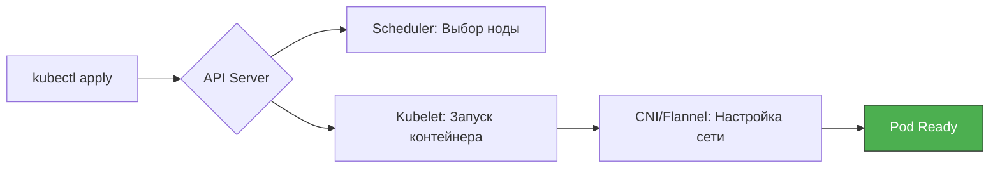

## 📖 Философия управления
Эффективная работа с Kubernetes строится на трех столпах: **Наблюдение**, **Диагностика** и **Управление ресурсами**. Данный гайд содержит команды, проверенные «в бою» при развертывании стека на k3s.

---

## 🛠️ 1. Быстрый старт и Инфраструктура
Команды для проверки общего состояния кластера и его узлов.

* `kubectl get nodes -o wide` — Проверка статуса нод и их **Internal-IP** (важно для проверки работы `eth1` в Vagrant).
* `kubectl cluster-info` — Посмотреть адреса API-сервера и сервисов.
* `kubectl get events -A --sort-by='.lastTimestamp'` — Показать последние события во всем кластере (лучший способ понять, почему что-то упало).

---

## 🏗️ 2. Управление ресурсами (Deployments & Pods)
Работа с твоими сервисами (`booking`, `report`, `postgres`).

* `kubectl apply -f <file.yml>` — Применить манифест.
* `kubectl delete -f <file.yml>` — Удалить ресурсы, описанные в файле.
* `kubectl get pods -n default` — Список всех подов в дефолтном пространстве имен.
* `kubectl rollout restart deployment/<name>` — Мягкий перезапуск сервиса (например, после обновления ConfigMap).
* `kubectl scale deployment/<name> --replicas=3` — Быстрое масштабирование сервиса.

---

## 🔍 3. Глубокая диагностика (Troubleshooting)
Когда сервис выдает `500 Error` или статус `Pending`.

* `kubectl describe pod <pod_name>` — **Самая важная команда.** Показывает логи старта, ошибки монтирования дисков и нехватку ресурсов.
* `kubectl logs -f <pod_name>` — Стриминг логов контейнера (логи Spring Boot или Postgres).
* `kubectl logs -l app=<label>` — Просмотр логов сразу всех подов с определенной меткой.
* `kubectl exec -it <pod_name> -- sh` — Зайти внутрь контейнера для ручной проверки (например, проверить наличие конфигов).

---

## 🌐 4. Сетевая отладка
Проверка связи между микросервисами (VXLAN, DNS).

* `kubectl get svc` — Посмотреть список сервисов и их ClusterIP/NodePort.
* `kubectl run -it --rm debug --image=busybox -- sh` — Запуск временного пода-терминала для тестов.
* **Тест DNS:** `nslookup postgres` (внутри debug-пода).
* **Тест связи:** `nc -zv hotel-service 8082` (проверка доступности порта соседа).
* **Сетевой фикс (на хосте ноды):** `sudo ethtool -K eth1 tx off` — Отключение битых чек-сумм в VirtualBox.

---

## 📦 5. Работа с конфигурациями (ConfigMap & Secrets)

* `kubectl get configmap app-config -o yaml` — Посмотреть текущие настройки окружения.
* `kubectl get secret app-secrets -o jsonpath='{.data.DB_PASSWORD}' | base64 -d` — Декодировать пароль из Secret (чтобы убедиться, что он верный).
* `kubectl edit configmap app-config` — Редактировать конфиг «на лету» (требует рестарта подов).

---

## 📊 6. Визуализация потоков (Mermaid)

---

## 📒 7. Словарь Hardcore DevOps

| Команда | Зачем она тебе? |
| :--- | :--- |
| **Port-forward** | `kubectl port-forward svc/rabbitmq 15672:15672` — Проброс порта сервиса на твой локальный ПК (чтобы открыть админку кролика в браузере). |
| **Top** | `kubectl top pods` — Посмотреть потребление CPU и RAM (помогает выявить причину зависаний). |
| **Explain** | `kubectl explain deployment.spec` — Справочник по полям манифеста прямо в терминале. |

---

## ✅ 8. Чек-лист при падении сервиса
1.  **Status Check:** `kubectl get pods` (ищи `CrashLoopBackOff` или `Pending`).
2.  **Describe:** `kubectl describe pod ...` (смотри секцию `Events` в конце).
3.  **Logs:** `kubectl logs ...` (ищи `Stacktrace` или `Connection Refused`).
4.  **Networking:** `kubectl exec` в соседний под и попробуй `ping` или `nc`.