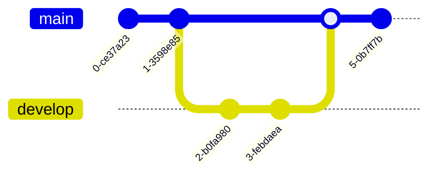

---
tags:
  - git
  - devops
  - architecture
  - programming
  - guide
date: 2026-04-12
type: technical-note
---

# 🛠 Git: Глубокое погружение в архитектуру и процессы

> [!abstract] О чем эта заметка
> Анализ фундаментальных принципов Git: от контентно-адресуемой файловой системы до распределенных рабочих процессов и внутреннего устройства объектов.

---

## 1. Концептуальный фундамент: Модель данных и состояния

### Парадигма: Snapshots vs Deltas
В отличие от классических VCS (Subversion, Perforce), хранящих список изменений (**deltas**), Git оперирует **снимками** (snapshots).

* **Снимки**: Если файл не менялся, Git просто создает ссылку на предыдущую версию.
* **Целостность**: Все данные адресуются по SHA-1 хешу. Если изменится хоть один бит — изменится и хеш.

### Три архитектурные зоны
> [!info] Жизненный цикл файла
> 1. **Working Directory**: Песочница, где вы правите файлы.
> 2. **Staging Area (Index)**: Черновик следующего коммита.
> 3. **.git Directory (Repository)**: База объектов и метаданных.

---

## 2. Ветвление: «Киллер-фича» Git

Ветвление в Git — это не копия файлов, а **40-байтный указатель**.

* **HEAD**: Специальный указатель на вашу текущую локальную ветку.
* **Merge vs Rebase**:
    * `Merge`: Создает "коммит слияния", сохраняя реальную хронологию.
    * `Rebase`: Переписывает историю, создавая линейный вид.

> [!warning] Золотое правило Rebase
> Никогда не делайте rebase коммитов, которые уже были отправлены в публичный репозиторий. Это разрушит историю для всей команды.

---

## 3. Распределенные рабочие процессы

| Модель | Описание | Применение |
| :--- | :--- | :--- |
| **Integration Manager** | Форки + Pull Requests | GitHub / Open Source |
| **Dictator & Lieutenants** | Иерархия доверия | Ядро Linux |
| **Centralized** | Один сервер, одна ветка | Небольшие команды |

---

## 4. Продвинутый инструментарий мастера

### Git Reset: Мастерство Трех Деревьев
| Флаг | HEAD | Index | Working Directory |
| :--- | :---: | :---: | :---: |
| `--soft` | ✅ Перемещен | ❌ Нет | ❌ Нет |
| `--mixed` | ✅ Перемещен | ✅ Обновлен | ❌ Нет |
| `--hard` | ✅ Перемещен | ✅ Обновлен | ✅ Обновлен (Опасно!) |

### Инструменты отладки и чистки
* `git bisect`: Бинарный поиск виновного коммита.
* `git filter-branch`: "Ядерная опция" для удаления паролей из всей истории.

---

## 5. Git изнутри: Анатомия объектов

Git — это **контентно-адресуемая файловая система**. В папке `.git/objects` живут:

1.  **Blobs** (Binary Large Objects): Содержимое файлов.
2.  **Trees**: Структура папок (имена файлов + ссылки на Blobs).
3.  **Commits**: Снимок дерева + автор + сообщение + ссылка на родителя.

> [!tip] Plumbing vs Porcelain
> * **Porcelain** (Фарфор): `git commit`, `git log` — команды для людей.
> * **Plumbing** (Сантехника): `git hash-object`, `git update-index` — низкоуровневые команды для скриптов.

#git #architecture #devops