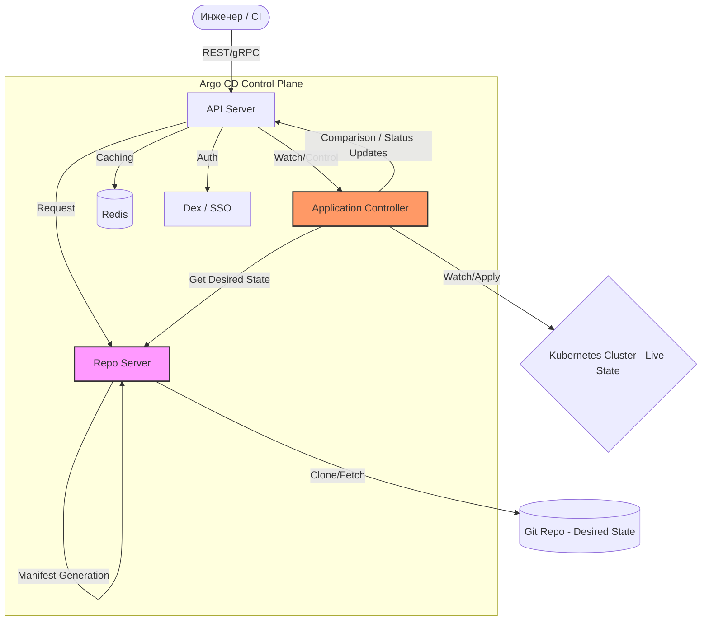

# Архитектура Argo CD: Глубокое погружение для инженеров

Разделение ответственности между компонентами Argo CD — это не просто архитектурное решение, а стратегический фундамент для обеспечения безопасности и масштабируемости GitOps-процессов. В промышленной эксплуатации изоляция функций позволяет минимизировать «радиус поражения» (blast radius) при компрометации отдельных сегментов и обеспечивает стабильную работу системы в условиях сотен микросервисов и мультикластерных сред.

---

## 1. Фундаментальные компоненты системы и их зоны ответственности

Архитектура Argo CD спроектирована по принципу микросервисов, где каждый компонент решает узкоспециализированную задачу, обеспечивая общую отказоустойчивость.

*   **API Server:** Единая точка входа для всех взаимодействий (UI, CLI, gRPC/REST). Его ключевая роль — аутентификация и жесткое соблюдение RBAC. В производственной среде он служит центральным узлом управления правами доступа, позволяя разграничивать полномочия между командами разработки и эксплуатации.
*   **Repository Server:** Внутренний сервис, выполняющий роль «движка трансляции». Он клонирует репозитории и генерирует манифесты (Helm, Kustomize, Jsonnet). **Критически важно:** этот компонент не имеет доступа к Kubernetes API. Такая изоляция является фундаментальным барьером безопасности: даже если злоумышленник скомпрометирует шаблон в Git, он не сможет напрямую обратиться к кластеру через Repo Server.
*   **Application Controller:** Настоящее «сердце» и первичный движок реконсиляции. Он непрерывно мониторит кастомные ресурсы (Application CRD), сравнивая желаемое состояние с реальным. Его стабильность определяет скорость обнаружения дрейфа конфигурации. Контроллер также отвечает за масштабирование в мультикластерных сценариях, взаимодействуя с API-серверами целевых кластеров.
*   **Redis и Dex/Notification:** Вспомогательные, но критические службы. Redis минимизирует задержки в цикле реконсиляции и предотвращает блокировки (rate-limiting) со стороны Git-провайдеров за счет кэширования состояний. Dex обеспечивает интеграцию с SSO (OIDC/SAML) для корпоративной идентификации, а сервис уведомлений автоматизирует фидбэк-петлю для инженеров.

Эти статические компоненты формируют среду, в которой реализуется динамический жизненный цикл манифестов.

---

## 2. Анатомия синхронизации: жизненный цикл манифеста «под капотом»

Argo CD реализует Pull-модель, где непрерывная сверка (reconciliation loop) гарантирует соответствие инфраструктуры декларативному источнику истины. В отличие от Push-модели, кластер сам контролирует состояние, исключая необходимость хранения секретов доступа в CI-системах.

Процесс прохождения изменений от Git до кластера:

1.  **Обнаружение изменений:** Repo Server узнает о коммите через Webhook (мгновенно) или опрос (Polling). Это инициирует проверку актуальности кэша в Redis.
2.  **Генерация манифестов:** Repo Server рендерит исходный код в «чистый» (Raw) YAML. Поскольку Kubernetes API не понимает шаблоны Helm или Kustomize напрямую, Repo Server переводит их на язык нативных спецификаций.
3.  **Сравнение состояний (Diffing):** Application Controller сопоставляет *Desired State* (полученный от Repo Server) и *Live State* (текущие объекты в кластере). Если обнаружено расхождение, приложению присваивается статус `OutOfSync`.
4.  **Применение (Reconciliation):** Контроллер устраняет дрейф, применяя изменения в целевом пространстве имен. Здесь реализуется механизм **Self-healing** (самовосстановление) — автоматическая реакция системы на ручные изменения в кластере, возвращающая их к состоянию, зафиксированному в Git.

Этот цикл превращает Git в единственный достоверный источник конфигурации, обеспечивая повторяемость среды.

---

## 3. Декларативное управление vs Императивное воздействие

Выбор между декларативным описанием ресурсов (CRD) и императивным использованием CLI/UI определяет уровень аудита и прозрачности инфраструктуры.

| Метод управления | Роль и область применения | Источник аудита | Production Use Case |
| :--- | :--- | :--- | :--- |
| **Custom Resource (`Application`)** | «Золотой стандарт» GitOps. Описание Source, Destination и SyncPolicy в коде. | История коммитов в Git | Стандартные CI/CD пайплайны, автоматизация доставки. |
| **Web UI и CLI** | Визуализация здоровья (Health Status) и оперативная отладка. | Логи API Server | Аварийное восстановление, ручное вмешательство, отладка. |

> [!WARNING]
> Императивные инструменты в production-средах должны рассматриваться только как средства наблюдения и экстренного реагирования. Декларативный подход гарантирует, что любое изменение прошло через процесс ревью и зафиксировано в истории.

Связь всех компонентов и потоков данных наглядно представлена на схеме ниже.

---

## 4. Визуализация архитектуры

Диаграмма взаимодействия компонентов отражает путь манифеста и логику сверки состояний.

