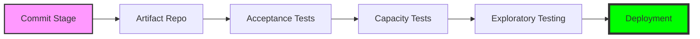

---
tags:
  - devops
  - continuous-delivery
  - architecture
  - notes
source: "A Practical Guide to Continuous Delivery (Eberhard Wolff)"
status:  Study
date: 2026-04-10
---

#  Непрерывная поставка и культура DevOps

> [!abstract] Стратегическая цель
> Превращение выпуска ПО в предсказуемую и рутинную операцию. Переход от редких релизов-"подвигов" к непрерывному потоку ценности.

---

## 1. Фундамент: CD vs Deployment
Критическое разграничение процессов автоматизации:

| Понятие | Суть | Решение о релизе |
| :--- | :--- | :--- |
| **Continuous Delivery** | Код всегда в релизопригодном состоянии. | Принимается **человеком** (бизнес-решение). |
| **Continuous Deployment** | Автоматический деплой каждого успешного коммита. | Принимается **автоматически** (системой). |

> [!error] Риск-менеджмент
> Ручной труд в критических системах ведет к катастрофе. **"Если что-то причиняет боль — делайте это чаще"**. Мелкие изменения = низкая сложность = мгновенное обнаружение ошибок.

---

## 2. Анатомия Pipeline: "Конвейер доверия"

### Ключевые узлы:
* **Commit Stage**: Unit-тесты и статический анализ (**SonarQube**). Feedback loop — минуты.
* **Artifact Management**: Отказ от `SNAPSHOT`. Каждый билд — потенциальный релиз с уникальной версией. (Nexus/Artifactory).
* **Acceptance Tests**: 
    * Соблюдение **Пирамиды тестирования**.
    * Использование паттерна **Page Object** для стабильности GUI-тестов.
* **Deployment**: Стратегии **Blue/Green** и **Canary**.

---

## 3. Культура и Методология

### DevOps & Lean
* **"You build it, you run it"**: Разработчик несет ответственность за эксплуатацию.
* **5 Whys**: Поиск системной первопричины, а не виновных.
* **Устранение потерь (Waste)**: Код вне продакшена — это замороженный капитал.

### Value Stream Mapping (VSM)
Инструмент выявления узких мест.
* **Processing Time**: Время работы.
* **Wait Time**: Время простоя (одобрения, настройки).
> [!tip] Архитектурный инсайт
> Автоматизация неэффективного процесса лишь ускоряет хаос. Наша цель — сокращение **Wait Time** (до 90% времени цикла).

---

## 4. Infrastructure as Code (IaC)
Инфраструктура должна управляться как программный код.

* **Phoenix Server (Сервер-Феникс)**: Мы никогда не правим "живой" конфиг. При изменениях сервер уничтожается и создается заново из кода.
* **Immutable Infrastructure**: Гарантия отсутствия "дрейфа конфигураций".
* **Инструментарий**: Puppet, Chef, Ansible, Salt.

---

## 5. Метрики эффективности (KPI)

| Метрика | Что измеряет | Цель |
| :--- | :--- | :--- |
| **Lead Time** | Время от коммита до продакшена. | Минимизация |
| **Deployment Frequency** | Частота релизов. | Переход от месяцев к часам |
| **Change Failure Rate** | Доля багов после деплоя. | Снижение |