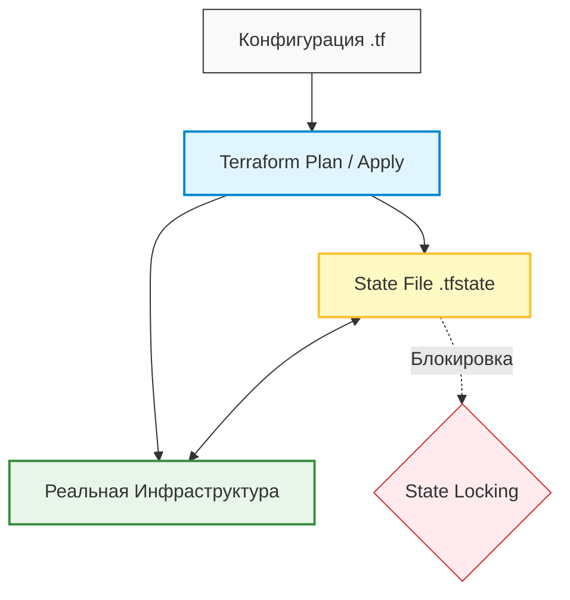

# Terraform: Базовые концепции и архитектура

---

## 1. Философия Infrastructure as Code (IaC) и парадигма Terraform

Современная ИТ-эксплуатация завершила стратегический переход от «ручного» администрирования к парадигме Infrastructure as Code (IaC). В прошлом уникальные настройки серверов («серверы-снежинки») неизбежно приводили к дрейфу конфигурации (*configuration drift*). Terraform стал стандартом де-факто для провижининга, превращая создание инфраструктуры в предсказуемый процесс развертывания ПО.

### Фундаментальные характеристики

* **Agentless (Безагентная архитектура):** В отличие от Puppet или Chef, Terraform не требует установки специализированного ПО на целевые ресурсы. Взаимодействие происходит напрямую через API облачных провайдеров или гипервизоров.
* **Push-модель:** Изменения инициируются управляющим узлом и «проталкиваются» в инфраструктуру, что упрощает централизованный контроль и аудит.
* **Декларативный подход:** Вместо императивного «списка команд» (как в скриптах или Ansible, который по своей природе ближе к процедурным инструментам на уровне конфигурации ОС), вы описываете финальное целевое состояние («чертеж»). Terraform сам вычисляет необходимые действия для достижения этой цели.

### Изменяемость vs Неизменяемость

Terraform реализует концепцию **Immutable Infrastructure** (неизменяемой инфраструктуры). Вместо внесения правок в работающие системы, инструмент зачастую уничтожает старый ресурс и создает новый из обновленного образа. Это гарантирует **идемпотентность**: возможность многократного запуска одного и того же кода с гарантией идентичного результата без побочных эффектов.

> **Architectural Insight:** Использование Terraform минимизирует риски, связанные с «человеческим фактором», позволяя восстанавливать инфраструктуру в другом регионе за считанные минуты в случае катастрофического сбоя.

---

## 2. Архитектурные компоненты и язык HCL

Архитектура системы строится на строгом разделении логики управления (Terraform Core) и механизмов взаимодействия с целевыми платформами (Providers).

### Terraform Core & Providers

* **Core:** Компилируемый бинарный файл на языке Go, отвечающий за чтение конфигурационных файлов, жизненный цикл ресурсов, вычисление разницы состояний и расчет графа зависимостей.
* **Providers:** Изолированные плагины-драйверы, транслирующие высокоуровневые вызовы Terraform в специфические API-запросы конкретных платформ (AWS, Yandex Cloud, Kubernetes, Docker, Vagrant и др.).

> **Provider Mirroring:** В условиях сетевых ограничений или блокировок со стороны официального HashiCorp Registry критически важно использование локальных или корпоративных зеркал. Настройка через файл конфигурации `.terraformrc` позволяет прозрачно перенаправить запросы на внутренние репозитории (например, зеркало Яндекс Облака).

### Синтаксис HCL2 и динамическая инфраструктура

Современный стандарт HCL2 поддерживает строгую типизацию, сложные структуры данных и встроенные функции.

```hcl
terraform {
  required_version = ">= 1.0.0"

  required_providers {
    yandex = {
      source  = "yandex-cloud/yandex"
      version = "~> 0.80" # Фиксация мажорной версии провайдера
    }
  }
}

# Data Source: путь к динамической инфраструктуре без хардкода ID
data "yandex_compute_image" "ubuntu" {
  family = "ubuntu-2004-lts"
}

# Resource: объявление управляемого объекта
resource "yandex_compute_instance" "web" {
  name        = var.instance_name
  platform_id = "standard-v3"
  zone        = "ru-central1-a"

  resources {
    cores  = 2
    memory = 2
  }

  boot_disk {
    initialize_params {
      image_id = data.yandex_compute_image.ubuntu.id # Динамическая подстановка ID
    }
  }

  network_interface {
    subnet_id = var.subnet_id
    nat       = true
  }
}

```

### Resources vs Data Sources

| Тип блока | Назначение | Жизненный цикл | Применение |
| --- | --- | --- | --- |
| **Resources** | Создание и управление | Напрямую управляется Terraform (Create, Update, Delete) | Развертывание виртуальных машин, сетей, баз данных |
| **Data Sources** | Чтение декларативных данных | Только чтение (*Read-only*) во время выполнения кода | Получение актуальных ID образов, подсетей, сертификатов |

---

## 3. Жизненный цикл (Workflow) и управление состоянием

Процесс работы с Terraform — это строго детерминированный жизненный цикл, обеспечивающий безопасность вносимых изменений.

### Основные команды (Core Workflow)

1. `terraform init`: Инициализация рабочей директории, подготовка бэкенда, загрузка указанных провайдеров и внешних модулей.
2. `terraform plan`: Сравнение текущего кода с реальным состоянием инфраструктуры. Генерация и вывод спеки изменений (что будет добавлено, изменено или удалено) без фактического применения.
3. `terraform apply`: Фиксация изменений. Повторный расчет графа и выполнение API-вызовов для приведения инфраструктуры к целевому виду.
4. `terraform destroy`: Полный демонтаж и удаление всех ресурсов, находящихся под управлением данной конфигурации.

### Terraform State (Единый источник истины)

Файл `terraform.tfstate` хранит точный маппинг между объявленными в коде абстракциями и реальными ID объектов в облаке.

> **CRITICAL WARNING:** Любые ручные изменения ресурсов через веб-консоль в обход кода создают расхождения (*configuration drift*). Это ведет к повреждению стейта или непредсказуемому поведению при следующем запуске.

Для командной разработки обязателен **Remote State** — перенос файла состояния в удаленное отказоустойчивое хранилище (Object Storage / S3, Consul). Ключевым механизмом здесь выступает **State Locking** (блокировка стейта). При отсутствии блокировки одновременный запуск команды `apply` двумя инженерами гарантированно приведет к состоянию гонки (*race condition*) и повреждению структуры файла состояния.

### Визуализация Workflow

