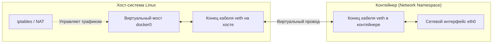

# Сетевой стек Docker: Архитектура и Драйверы

Сетевая подсистема Docker отвечает за две вещи: дать контейнерам связаться друг с другом и изолировать их ради безопасности.

---

## 1. Архитектурный базис (Спецификация CNM)

Вся сеть в Docker строится на модели **CNM (Container Network Model)**. Она состоит из трех простых кирпичиков:

1. **Sandbox (Песочница):** Изолированный сетевой стек самого контейнера (свои порты, маршруты, DNS). В ядре Linux это называется **Network Namespace**.
2. **Endpoint (Конечная точка):** Виртуальный сетевой разъем (как сетевая карта `eth0`), который вставляется в контейнер.
3. **Network (Сеть):** Виртуальный коммутатор (свитч), к которому подключаются эндпоинты.

### Как контейнер общается с хостом: veth-пары

Контейнер сидит в своей изолированной «коробке». Чтобы связать его с сетью хоста, Docker создает **veth-пару (virtual Ethernet)** — это работает как виртуальный патч-корд. Один конец провода втыкается в контейнер, а второй остается на хосте и подключается к общему мосту `docker0`.



> [!info] Проброс портов (Port Mapping)
> Запросы из внешнего мира на порты хоста переводятся внутрь контейнеров через правила **iptables (NAT)**. Это дает удобство, но создает небольшой оверхед (задержку) на обработку каждого пакета.

---

## 2. Четыре сетевых драйвера: Какой когда выбирать?

Драйвер определяет, по каким правилам будет работать сеть контейнера.

### 2.1. Bridge (Мост) — По умолчанию

Создает виртуальный свитч на хосте. Контейнеры получают свои внутренние IP-адреса.

* **Default Bridge (`docker0`):** Базовая сеть. Главный минус — **нет авторазрешения имен по DNS**. Контейнеры могут общаться только по IP-адресам.
* **User-Defined Bridges (Пользовательские сети):** Лучшая практика. Docker автоматически поднимает внутренний DNS-сервер. Контейнеры могут пинговать друг друга прямо по именам (названию контейнера).

### 2.2. Host — Напрямую через хост

Контейнер полностью убирает сетевую изоляцию и использует сетевой стек хоста.

* **Плюс:** Максимальная скорость (Native speed), нулевой оверхед, нет NAT.
* **Минус:** Проблема с безопасностью (контейнер видит сеть хоста) и конфликты портов (нельзя запустить два контейнера на 80 порту).

### 2.3. Overlay — Для кластеров (Multi-host)

Связывает контейнеры, запущенные на разных физических серверах (в Swarm кластере).

* **Как работает:** Использует технологию **VXLAN** — упаковывает сетевые фреймы контейнеров в обычные UDP-пакеты и перекидывает их между серверами.
* **Требование:** Требует открытых портов `4789` (для данных) и `7946` (для обмена состоянием сети).

### 2.4. None (Null) — Полная изоляция

У контейнера есть только петлевой интерфейс `localhost (127.0.0.1)`. Внешнего мира и других контейнеров для него не существует.

* **Зачем нужен:** Для безопасных локальных вычислений (например, парсинг логов или тяжелые расчеты над локальными файлами).

---

## 3. Шпаргалка по выбору драйвера

| Критерий | Bridge (User-defined) | Host | Overlay | None |
| --- | --- | --- | --- | --- |
| **Производительность** | Средняя (есть NAT) | Максимальная | Ниже средней (VXLAN) | Н/Д |
| **Изоляция сети** | Высокая | Отсутствует | Высокая | Абсолютная |
| **DNS по имени** | Да | Нет | Да | Нет |
| **Работа на 2+ хостах** | Нет | Нет | Да (Нативно в Swarm) | Нет |

---

## 4. Шпаргалка по командам (CLI Cheat Sheet)

### Создание сети с кастомной подсетью

```bash
# Создаем изолированный мост со своим пулом IP
docker network create --driver bridge --subnet 192.168.30.0/24 my_custom_net

```

### Проверка состояния сети (Аудит)

```bash
# Показывает подробный JSON: какие контейнеры подключены и их IP-адреса
docker network inspect my_custom_net

```

### Динамическое управление в Runtime (Без перезапуска контейнеров)

```bash
# Подключить уже работающий контейнер к новой сети
docker network connect my_custom_net my_running_container

# Отключить контейнер от сети
docker network disconnect my_custom_net my_running_container

```

### Очистка мусора

```bash
# Удаляет все неиспользуемые сети, освобождая подсети и правила iptables
docker network prune

```