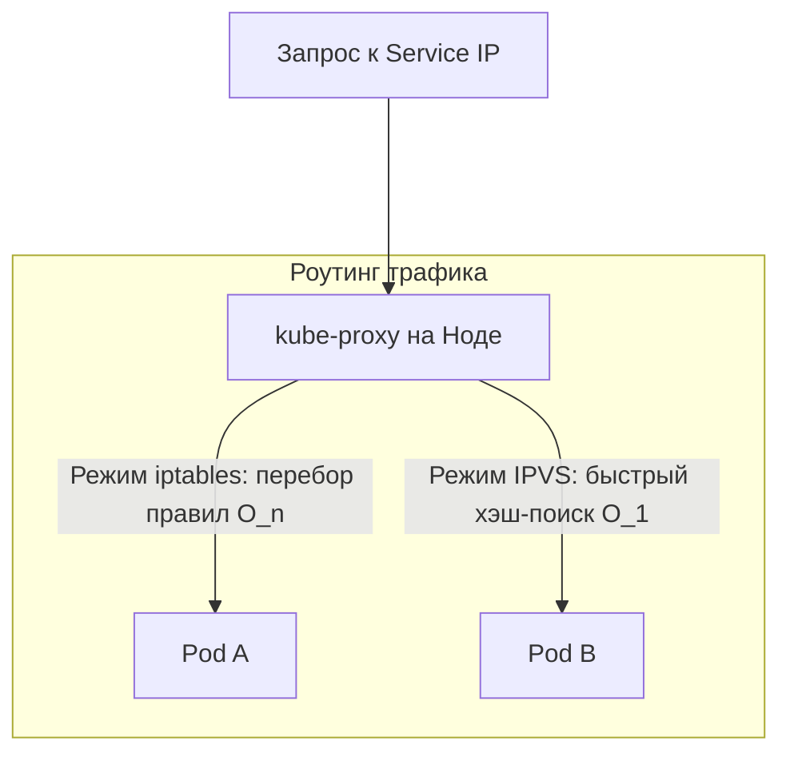
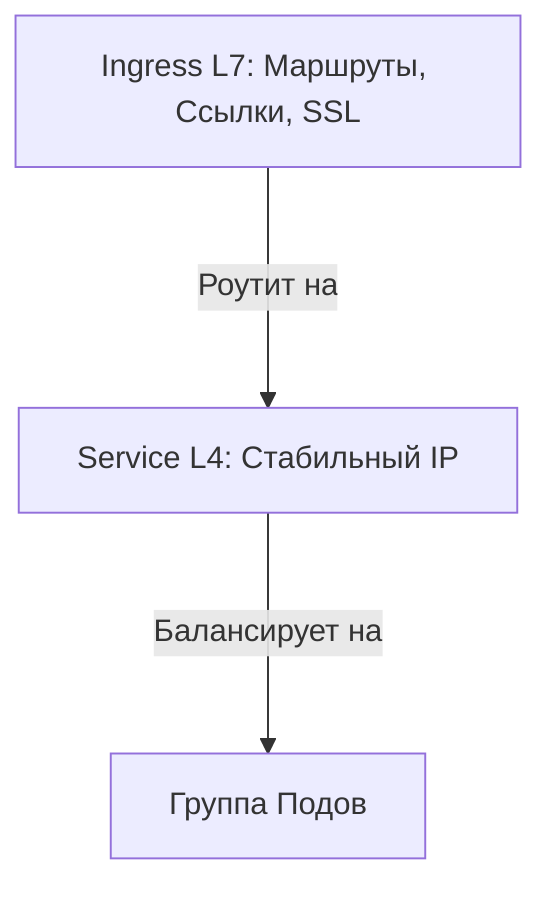

# Сетевая архитектура Kubernetes (K8s Networking)

Сетевая модель Kubernetes связывает сотни динамических контейнеров на разных серверах в единую, прозрачную для разработчика сеть.

---

## 1. Фундаментальные принципы сети K8s

В отличие от Docker, где нужно постоянно пробрасывать порты хоста наружу, в Kubernetes всё устроено иначе.

### Принцип «IP-per-Pod»

Каждому Поду (Pod) выделяется свой собственный, уникальный во всем кластере IP-адрес.

* Любой Под может напрямую обратиться к любому другому Поду без всяких трансляций адресов (без NAT).
* Отправитель и получатель всегда видят реальные IP-адреса друг друга. Это критически упрощает отладку и мониторинг.
* Контейнеры **внутри одного Пода** делят один сетевой стек и общаются друг с другом мгновенно через `localhost`.

### Зачем нужен kube-proxy?

Поды постоянно рождаются и умирают, их IP меняются. Чтобы иметь стабильную точку входа, используются **Сервисы (Services)** с виртуальным IP. А за роутинг трафика на этот IP отвечает демон **kube-proxy**, который крутится на каждой ноде.

У него есть два основных режима работы:

1. `iptables` (По умолчанию): Трафик перенаправляется стандартными правилами ядра Linux. Минус: правила проверяются по очереди. Если в кластере тысячи сервисов, поиск нужного правила нагружает процессор (сложность $O(n)$).
2. `IPVS` (IP Virtual Server): Использует эффективные хэш-таблицы в ядре. Поиск происходит мгновенно (сложность $O(1)$) независимо от размера кластера. Этот режим обязателен для больших высоконагруженных систем.



---

## 2. Что такое CNI (Сетевые плагины)

Kubernetes сам по себе не настраивает сеть — он лишь дает спецификацию, как она должна работать. Реальная настройка интерфейсов и маршрутов ложится на плечи **CNI (Container Network Interface)** плагинов.

Вот три главных игрока на рынке:

* **Flannel:** Самый простой вариант («поставил и забыл»). Создает поверх реальной сети виртуальную (Overlay-сеть через VXLAN). Упаковывает пакеты подов в обычные UDP-пакеты. **Минус:** создает накладные расходы на упаковку трафика и не умеет управлять безопасностью (Network Policies).
* **Calico:** Работает на чистом сетевом уровне L3 без лишней упаковки трафика (использует протокол маршрутизации BGP). Работает быстрее, чем Flannel. **Плюс:** это золотой стандарт для настройки сетевых доступов и политик безопасности (Network Policies).
* **Cilium:** Самое современное решение. Вместо старых механизмов ядра Linux (iptables) использует технологию **eBPF**. Трафик обрабатывается прямо в ядре на максимальной скорости. Позволяет глубоко мониторить и защищать сеть даже на прикладном уровне (L7).

---

## 3. Абстракции доступа: Services и Ingress

Для публикации приложений вовне или распределения нагрузки внутри кластера используются разные типы ресурсов.



### Четыре типа K8s Services (Уровень L4)

1. **ClusterIP:** Доступен **только внутри кластера**. Это дефолтный тип для общения микросервисов между собой.
2. **NodePort:** Открывает конкретный порт (из диапазона 30000–32767) на всех серверах (нодах) кластера. Трафик на этот порт полетит внутрь Подов.
3. **LoadBalancer:** Работает в облаках (AWS, GCP, Yandex Cloud). Автоматически заказывает у провайдера внешний балансировщик с публичным IP.

### Ingress (Уровень L7)

Если Сервисы работают просто с портами и IP (L4), то **Ingress** умеет читать сам HTTP-трафик.

* Он позволяет настроить умный роутинг на основе доменов и путей (например: `[site.com/api](https://site.com/api)` — в один сервис, а `[site.com/static](https://site.com/static)` — в другой).
* Занимается **TLS-терминацией** (держит на себе SSL-сертификаты, разгружая контейнеры с кодом).
* *Важно:* Ingress — это просто манифест с правилами. Чтобы они работали, в кластере должен быть установлен **Ingress-контроллер** (обычно на базе Nginx или HAProxy).

---

## 4. Итоговая шпаргалка по сетевым ресурсам

| Ресурс | Уровень OSI | Где доступен | Для чего нужен |
| --- | --- | --- | --- |
| **ClusterIP** | L4 (IP/Порт) | Только внутри кластера | Общение микросервисов друг с другом |
| **NodePort** | L4 (IP/Порт) | Везде, через IP любой ноды | Базовый внешний доступ к портам |
| **LoadBalancer** | L4 (IP/Порт) | Снаружи (Интернет) | Продакшн-доступ в облачных инфраструктурах |
| **Ingress** | L7 (Приложение) | Снаружи (Интернет) | Хосты, URL-пути, SSL-сертификаты |

---

## 5. Практические команды для дебага сети (CLI Cheat Sheet)

### 1. Быстрый аудит точек входа

```bash
# Посмотреть все сервисы и ингрессы во всех нодспейсах разом
kubectl get svc,ingress -A

```

### 2. Проверка селекторов сервиса (Самая частая проблема)

Если сервис не отвечает, проверь, видит ли он поды:

```bash
# ИщемEndpoints — реальные IP подов, привязанные к сервису
kubectl get endpoints <имя-сервиса>

# Если список пуст — значит ты ошибся в блоке `selector` внутри манифеста сервиса!

```

### 3. Анализ логов роутера (L7 ошибки)

Если сайт выдает `502 Bad Gateway` или `504 Timeout`, проблема обычно в ингрессе:

```bash
# Читаем логи Nginx Ingress контроллера
kubectl logs -l app.kubernetes.io/name=ingress-nginx -n ingress-nginx --tail=50

```

### 4. Тест сети «изнутри» кластера

Самый надежный способ проверить DNS кластера и политики доступа — запустить временный под с утилитой `curl`:

```bash
# Запускаем интерактивный под-отладчик (удалится сам после выхода)
kubectl run net-debug --rm -it --image=curlimages/curl -- sh

# Внутри пода проверяем доступность по внутреннему домену:
curl -v http://<имя-сервиса>.<спейс>.svc.cluster.local

```