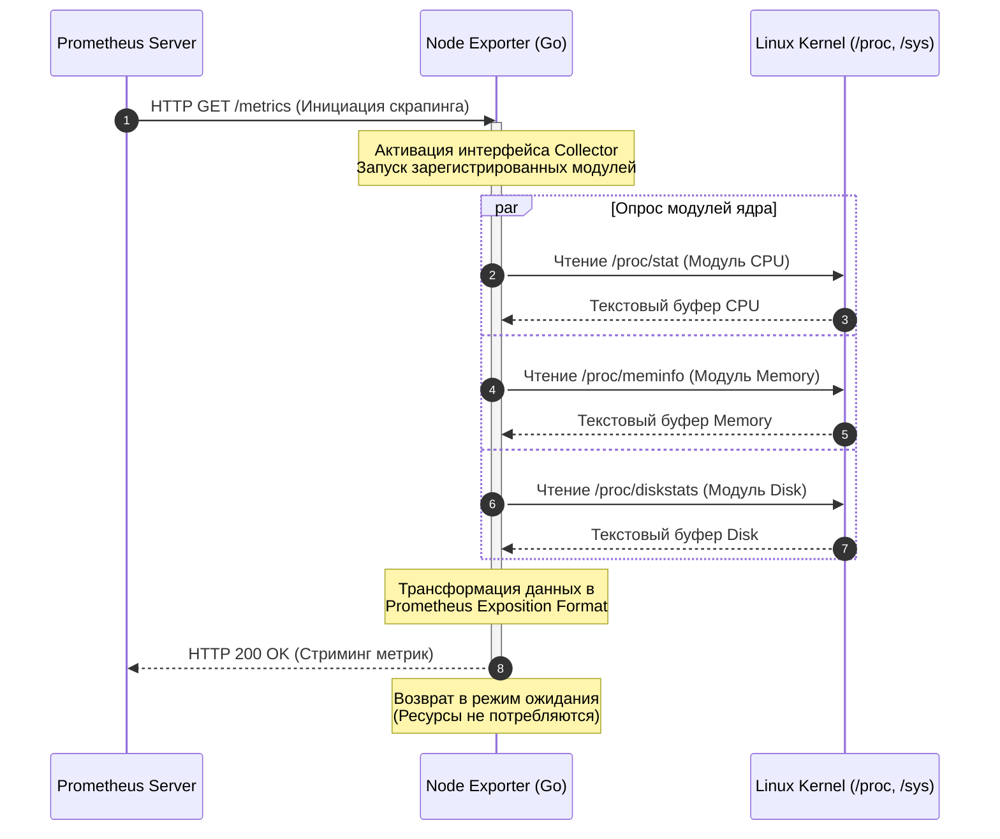

#  Архитектурный обзор Prometheus Node Exporter: Взаимодействие с ядром и системными интерфейсами

В современной SRE-практике **Node Exporter** выполняет роль стратегического, легковесного моста между *Kernel Space* и системой мониторинга. Его основная задача — эффективная трансформация внутренней телеметрии ядра в структурированный формат Prometheus. В отличие от тяжеловесных агентов прошлого, архитектура Node Exporter спроектирована с учетом жестких требований к минимизации оверхеда, чтобы сам процесс наблюдения не искажал производительность системы.

---

## ️ 1. Низкоуровневая архитектура и системные вызовы

### Механизм сбора данных: отказ от Fork/Exec
Ключевое архитектурное решение Node Exporter — **полный отказ от вызовов `exec()`** для запуска внешних утилит типа `top`, `ps` или `df`. С точки зрения планировщика задач Linux, частый запуск новых процессов (`fork/exec`) создает значительную нагрузку на CPU и увеличивает количество контекстных переключений. 

Вместо этого экспортер использует библиотеку **`procfs` на языке Go**, которая работает как прямой парсер виртуальных файловых систем. Это позволяет извлекать данные, оставаясь в рамках одного процесса, что критически важно для высоконагруженных окружений.

### Взаимодействие с `/proc` и `/sys`
Интерфейсы `/proc` и `/sys` — это окна в структуры данных ядра. Файлы здесь виртуальные: при чтении ядро динамически генерирует текстовый вывод. Node Exporter выполняет последовательное чтение этих интерфейсов, что является наиболее щадящим методом сбора данных. Такой подход не требует блокировок ядерных подсистем и потребляет минимум RAM/CPU, так как парсинг текстовых данных в Go-структуры оптимизирован на уровне работы с буферами.

### Жизненный цикл скрапинга
Работа экспортера реактивна. Жизненный цикл начинается в момент HTTP-запроса на эндпоинт `/metrics`:



---

##  2. Анатомия ключевых коллекторов и метрик

Эффективный мониторинг невозможен без понимания семантики метрик. Согласно классификации Prometheus, мы работаем с двумя основными типами:

* **Counter** — счетчик, который только растет; требует обязательной обработки функцией `rate()`.
* **Gauge** — текущее значение, которое может колебаться вверх и вниз.

> ️ **Ошибка архитектуры:** Использование функций вроде `rate()` или `increase()` для типа **Gauge** — одна из самых частых причин получения пустых графиков или некорректных алертов.

###  CPU (коллектор `cpu`)

Источник данных — `/proc/stat`. Метрика `node_cpu_seconds_total` является счетчиком времени, проведенного процессором в различных режимах.

* **"So What?" Layer (Утилизация и Steal Time):** Особое внимание SRE-архитектор должен уделять метрике `steal`. В облачных средах (VPS) высокий `steal time` указывает на *oversubscription* (переподписку) ресурсов гипервизором. Это ситуация «шумного соседа» (*noisy neighbor*), когда ваше приложение тормозит из-за того, что физический CPU занят другой виртуальной машиной. Это повод не для оптимизации кода, а для миграции или пересмотра SLA с провайдером.
* **PromQL и ловушка агрегации:** Для расчета процента занятости CPU используется `rate()` с окном `[5m]`. Пятиминутный интервал (*lookback delta*) — стандарт, позволяющий сгладить краткосрочные всплески и корректно обработать пропуски данных (*staleness*).

```promql
# Эталонный запрос утилизации CPU в процентах (по серверам)
sum by (instance) (rate(node_cpu_seconds_total{mode!="idle"}[5m])) * 100

```

>  **Критическая ошибка:** Забыть оператор `by (instance)`. Без него функция `sum()` «схлопнет» метрики всех серверов вашей инфраструктуры в одну бессмысленную линию.

###  Память (коллектор `meminfo`)

Источник — `/proc/meminfo`. Здесь важно различать физические и логические показатели.

* `MemFree`: Сырой счетчик абсолютно свободных, ничем не занятых страниц памяти.
* `MemAvailable`: Ядерная оценка (*kernel-level estimate*) объема памяти, который можно выделить процессам без ухода системы в swap. Она учитывает автоматически высвобождаемую (*reclaimable*) часть кэша и буферов.
* **"So What?" Layer:** Если `MemAvailable` стремится к нулю, ядро начнет агрессивно сбрасывать `Buffers` и `Cached`. Это приведет к лавинообразному росту *Disk I/O*, так как файлы перестанут кэшироваться в ОЗУ. Если вы видите падение кэша при низком `MemAvailable` — это жесткий сигнал к экстренному апгрейду ресурсов.

###  Дисковая подсистема (коллектор `diskstats`)

Данные из `/proc/diskstats` позволяют оценить насыщение (*Saturation*) диска. Метрика `node_disk_io_time_seconds_total` показывает суммарное время активных операций ввода-вывода.

* **"So What?" Layer:** Если `io_time` приближается к 1 секунде на секунду реального времени (100% утилизация по графику Grafana), но пропускная способность (*throughput*) остается низкой — вы столкнулись с аппаратным узким местом (деградация стореджа, затык по IOPS на сетевом диске или умирающий контроллер).

###  Сеть (коллектор `netdev`)

Из `/proc/net/dev` мы получаем не только сетевой трафик, но и счетчики ошибок: `errs` и `drop`.

* **"So What?" Layer:** Рост дропов (`node_network_receive_drop_total`) при низкой загрузке сетевого канала часто указывает на проблемы на уровне ОС — например, переполнение очередей дескрипторов (*ring buffers*), сетевых буферов ядра или ошибки на физическом уровне (L1/L2).

---

##  3. Расширение возможностей: Textfile Collector

Концепция *Observability as Code* подразумевает, что кастомные инфраструктурные метрики должны быть автоматизированы и легко расширяемы. Модуль **Textfile Collector** позволяет интегрировать в общий пайплайн любые данные (например, статус аппаратного RAID или время жизни SSL-сертификатов), просто считывая текстовые файлы с расширением `.prom`.

### Архитектура и обеспечение атомарности

Экспортер сканирует директорию, переданную через флаг `--collector.textfile.directory`. Чтобы избежать ситуации *Partial Write* (когда Prometheus считывает файл ровно в момент его перезаписи скриптом, получая битые данные), необходимо строго соблюдать **паттерн атомарной замены**:

```bash
# ПРАВИЛЬНЫЙ ПАТТЕРН: запись во временный файл + мгновенное перемещение через mv
/usr/local/bin/check_script.sh > /var/lib/node_exporter/metric.prom.tmp && \
mv /var/lib/node_exporter/metric.prom.tmp /var/lib/node_exporter/metric.prom

```

>  **Системный факт:** Команда `mv` в Linux является **атомарной операцией** на уровне системных вызовов файловой системы (если файлы находятся в пределах одного раздела), что гарантирует абсолютную целостность данных для скрапера Prometheus.

---

## ️ 4. Практика: Инспекция и Дебаг руками в CLI

Перед тем как строить дашборды в Grafana, инженер обязан верифицировать данные на уровне интерфейсов хоста.

###  Выборочный сбор (Filtering)

На нагруженных узлах с тысячами сетевых интерфейсов или дисков полный скрапинг может вызывать *Scrape Timeout*. Для точечной отладки конкретного модуля используйте query-параметры прямо в запросе:

```bash
# Запрос исключительно метрик диска для снижения нагрузки на вывод
curl -G 'http://localhost:9100/metrics' --data-urlencode 'collect[]=diskstats'

```

### ️ Генерация кастомных метрик

Пример создания метрики для мониторинга бэкапов. Используем Unix-таймштамп, так как Prometheus ожидает для суффиксов `_seconds` именно этот формат данных:

```bash
# Сохраняем время последнего успешного бэкапа (Unix timestamp) атомарным способом
echo "node_last_backup_timestamp_seconds $(date +%s)" > /var/lib/node_exporter/backups.prom.tmp && \
mv /var/lib/node_exporter/backups.prom.tmp /var/lib/node_exporter/backups.prom

```

---

##  Хардкорные вопросы по Node Exporter на собеседовании

* **Вопрос 1:** Node Exporter запущен в Docker-контейнере. Почему метрики CPU и RAM идентичны на всех контейнерах и совпадают с хостом, а метрики файловой системы — нет?
* *Тезис ответа:* По умолчанию пространств имен контейнера изолирует `/proc` и `/sys`. Для корректной работы экспортер должен запускаться с пробросом хостовых ФС (`-v "/proc:/host/proc:ro"`) и флагами конфигурации `--path.procfs=/host/proc`. Проблема с ФС возникает из-за того, что без проброса корня хоста и флага `--path.sysfs` экспортер видит только изолированный виртуальный `rootfs` самого контейнера, а не физические разделы сервера.


* **Вопрос 2:** Как настроить алерт о том, что место на диске полностью закончится через 4 часа, если текущий порог заполнения всего 50%?
* *Тезис ответа:* Использовать предиктивную функцию `predict_linear()` для метрики типа *Gauge* — `node_filesystem_free_bytes`. Она строит линейный тренд на основе истории изменения данных:
`predict_linear(node_filesystem_free_bytes{mountpoint="/"}[1h], 14400) < 0`. Это идеальный способ избежать ложных алертов и поймать аномально быструю утечку места.


* **Вопрос 3:** Как минимизировать влияние Node Exporter на "слабый" сервер с критической утилизацией ресурсов?
* *Тезис ответа:*
1. Явно отключить тяжелые или неиспользуемые коллекторы при запуске бинарника (например, `--no-collector.wifi`, `--no-collector.zfs`, `--no-collector.btrfs`) для предотвращения взрывного роста кардинальности.
2. Увеличить `scrape_interval` на стороне Prometheus для данного таpгета с 15 до 60+ секунд.
3. Использовать фильтрацию `collect[]` в конфигурации `scrape_configs` Prometheus, чтобы сервер запрашивал только жизненно важные метрики (CPU, Memory, Disk).