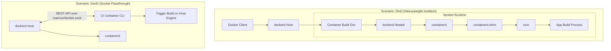

---
tags:
  - docker
  - dind
  - devops
  - cicd
  - security
date: 2026-08-06
aliases:
  - Docker in Docker
  - DinD Alternatives
---

# Docker in Docker (DinD) и альтернативы: Архитектура, безопасность и CI/CD

> [!abstract] Краткое содержание
> Разбор эволюции сборочных сред в DevOps: от классического Docker-in-Docker (DinD) и прагматичного Docker-out-of-Docker (DooD) до современных daemonless-инструментов (Kaniko, Buildah), обеспечивающих безопасную сборку образов в эфемерных пайплайнах.

---

## 1. Введение: Стратегический контекст и Mean Time to Build (MTTB)

В современной архитектуре DevOps мы окончательно отошли от концепции «серверов-питомцев» (*pet servers*) в пользу эфемерных сборочных сред. Переход от статических серверов к динамическим CI/CD-пайплайнам был продиктован необходимостью устранения **«дрейфа конфигураций» (build-server drift)** и минимизации **Mean Time to Build (MTTB)**.

Однако здесь мы сталкиваемся с классической проблемой «курицы и яйца»: для генерации неизменяемых (*immutable*) артефактов в виде Docker-образов внутри изолированного пайплайна нам требуется доступ к Docker Engine. Задача архитектора — обеспечить запуск Docker-команд внутри контейнера, сохранив при этом строгую изоляцию, безопасность хост-узла и эффективность кэширования слоев.

---

## 2. Классический Docker-in-Docker (DinD): Архитектура «матрешки»

Классический DinD подразумевает запуск полноценного, независимого экземпляра Docker внутри контейнера.

### Архитектурный разбор: Демоны и Шимы
Опираясь на внутреннее устройство Docker Engine, в DinD-контейнере развертывается собственный стек: `dockerd` (демон), который через gRPC управляет `containerd` (супервизором). На нижнем уровне `runc` создает пространства имен (*namespaces*) и `cgroups` внутри уже существующих ограничений родительского контейнера.

Критически важным компонентом здесь является **`containerd-shim`**. В этой иерархии именно shim становится родителем процесса контейнера после того, как `runc` завершает свою работу. Это обеспечивает работу *«daemonless containers»*: если вложенный `dockerd` перезапустится, контейнеры с приложениями выживут, так как shim поддерживает открытыми потоки `STDIN`/`STDOUT` и сохраняет состояние выполнения.

### Механизм запуска и цена привилегий
Для манипуляции `cgroups` вложенному демону требуется флаг `--privileged`. С точки зрения безопасности это катастрофа: данный флаг отключает практически все механизмы защиты ядра (`AppArmor`, `SECCOMP`) и дает контейнеру почти полный доступ к хосту.

> [!danger] Критический анализ недостатков
> * **Потеря Layer Sharing (кэширование):** Вложенный демон полностью изолирован от хранилища слоев (*layer store*) хоста. Он не видит уже скачанные базовые образы, что приводит к избыточным `docker pull` и резкому росту MTTB.
> * **Конфликт файловых систем:** Работа вложенного `overlay2` поверх родительского `overlay2` часто приводит к деградации производительности и ошибкам CoW (*Copy-on-Write*). В худших случаях приходится откатываться к крайне медленному драйверу `vfs`.
> * **Безопасность:** Любая компрометация вложенного демона означает компрометацию всего узла сборки.

---

## 3. Docker-out-of-Docker (DooD): Прагматизм через проброс сокета

DooD — это метод «обмана» клиента. Вместо запуска вложенного двигателя мы просто предоставляем контейнеру-сборщику интерфейс к Docker Engine хоста.

### Суть метода: REST API и сокеты
Сборщик не запускает свой демон. Мы монтируем Unix-сокет хоста: `-v /var/run/docker.sock:/var/run/docker.sock`. Внутри контейнера находится только бинарный файл CLI, который выступает в роли клиента. Он транслирует команды через REST API на основной демон хоста.

### Оценка преимуществ
DooD позволяет нативно использовать кэш хостового демона. Если образ `node:20` уже есть на ноде, сборка начнется мгновенно. Это самый эффективный путь с точки зрения скорости и экономии дискового пространства.

### Анализ рисков ("So What?"): Архитектурный приговор
Для архитектора DooD представляет собой критическую уязвимость. Доступ к сокету Docker — это фактические права `root` на хосте.

1. Компрометация сборщика позволяет атакующему не только украсть секреты, но и выполнить `docker rm -f` для всех соседних контейнеров.
2. Злоумышленник может использовать команды `docker network` для выхода из изолированной сети пайплайна и проникновения в производственные сегменты сети, к которым подключен хост.

#### Пример конфигурации (Volume Binding)
```yaml
# docker-compose.yml snippet
services:
  ci-runner:
    image: docker:24.0 # Только CLI
    volumes:
      - /var/run/docker.sock:/var/run/docker.sock

```

---

## 4. Современные безопасные альтернативы (Daemonless Builds)

Благодаря стандартам OCI (*Open Container Initiative*) v1.0 (`image-spec` и `runtime-spec`), мы можем использовать специализированные инструменты, которые работают по принципу «Unix-философии»: одна задача — одна утилита.

* **Kaniko (Google):** Ответ на запрет привилегированного режима в управляемых Kubernetes-средах (GKE, EKS). Kaniko не требует демона и работает полностью в пользовательском пространстве (*user namespace*). Он распаковывает базовый образ в файловую систему контейнера, выполняет команды и делает снимки (*snapshots*) изменений, отправляя слои напрямую в Registry. Кэширование здесь внешнее (*Registry-based*).
* **Buildah / Podman:** Эти инструменты следуют аналогии «рельс» от OCI. Если индустрия договорилась о стандарте «рельс» (OCI specs), нам не нужен монолитный Docker-поезд, чтобы просто собрать вагон. Buildah позволяет создавать образы послойно в `rootless`-режиме, не требуя фонового процесса (демона) вообще.
* **Sysbox (Nestybox):** Продвинутое решение на уровне виртуализации системы. Sysbox позволяет запускать полноценный `dockerd` внутри контейнера без флага `--privileged`, обеспечивая при этом изоляцию на уровне, сопоставимом с виртуальными машинами.

---

## 5. Сравнительный анализ подходов

| Подход | Наличие демона | Режим запуска | Кэширование слоев | Уровень безопасности |
| --- | --- | --- | --- | --- |
| **DinD** | Да (вложенный) | Привилегированный | Сложно (Cache miss на хосте) | Низкий |
| **DooD** | Нет (Shared) | Доступ к сокету | Нативно (Layer Sharing) | Критический (Root на хосте) |
| **Kaniko** | Нет | Rootless / User NS | Registry-based (Push/Pull) | Высокий |
| **Buildah** | Нет | Rootless | Нативно / OCI-совместимо | Высокий |

---

## 6. Архитектурная визуализация компонентов

Ниже представлена схема прохождения команд от клиента к ядру для обоих сценариев.



## 7. Заключение

Выбор метода сборки — это всегда баланс между скоростью (MTTB) и безопасностью (Security Posture).

> [!tip] Рекомендации по выбору
> * **Для Kubernetes (GKE/EKS/Self-hosted):** Использовать **Kaniko** или **Buildah**. В средах, где `--privileged` запрещен на уровне политик (PSP/Kyverno), это единственные жизнеспособные варианты.
> * **Для высоконагруженных приватных CI-ферм:** **DooD** допустим только при условии полной изоляции узла сборки от продуктивных сетей и использовании одноразовых (*disposable*) виртуальных машин для каждого запуска.
> * **Для локальных тестов инфраструктуры Docker:** **DinD** остается актуальным для тестирования самого Docker, Docker Swarm или сетевых плагинов, где требуется полная эмуляция сетевого стека внутри одного узла.
> 
> 

**Стратегический вектор:** Рекомендуется миграция на daemonless инструменты. Это упрощает архитектуру, избавляя нас от монолитных абстракций `dockerd` там, где нам нужна лишь простая сборка OCI-образа.