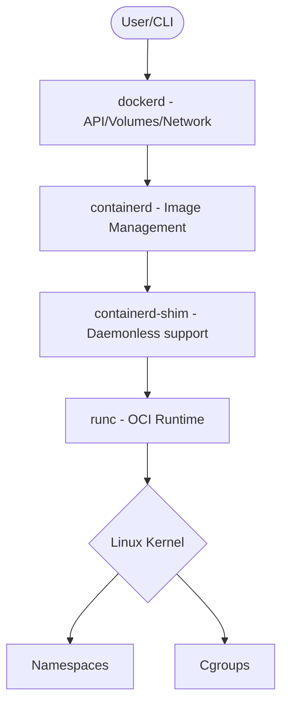

# ️ OCI (Open Container Initiative)

> [!ABSTRACT] Суть
> **OCI** — это промышленный стандарт, который превратил контейнеризацию из «магии Docker» в предсказуемую инженерную дисциплину. Это «отраслевой контракт», гарантирующий совместимость между разными инструментами (Docker, Podman, Kubernetes).

---

## ⏳ 1. Исторический контекст

До 2015 года индустрия стояла на пороге «войны форматов» (аналог Blu-ray vs HD-DVD):

* **Проблема:** Конкуренция Docker против `appc/rkt` (CoreOS). Риск фрагментации рынка.
* **Решение:** Создание OCI под эгидой **Linux Foundation**.
* **Жертва Docker:** Передача низкоуровневого инструмента `runc` в общее достояние.

---

##  2. Две опоры стандарта

OCI разделяет статическое состояние приложения от динамического процесса.

| Спецификация | За что отвечает | Аналогия |
| --- | --- | --- |
| **Image Spec** | Формат архива, слои (layers) и манифест (JSON). | **Чертеж вагона** |
| **Runtime Spec** | Жизненный цикл, изоляция (namespaces, cgroups). | **Ширина колеи** |

> [!QUOTE] Золотое правило
> Наличие этих «рельсов» позволяет инженерам быть уверенными: их «поезд» дойдет до «станции» без смены колесных пар.

---

## ️ 3. Tiered Runtime Architecture (Docker Engine)

Современный Docker — это слоеный пирог, где каждый слой соответствует OCI.

### Иерархия компонентов:

1. **`dockerd`**: Высокоуровневое API, сети, тома.
2. **`containerd`**: Менеджер жизненного цикла (скачивание образов).
3. **`containerd-shim`**: "Прослойка". Позволяет обновлять демон Docker, не убивая запущенные контейнеры.
4. **`runc`**: Низкоуровневый исполнитель. Делает `unshare` и `cgroups` (ровно то, что мы делали вручную), запускает процесс и самоустраняется.

---

##  4. Значение для DevOps

Почему это критически важно знать:

* **No Vendor Lock-in:** Легкий переход `Docker -> Podman -> CRI-O`.
* **Экосистема безопасности:** Сканеры (Trivy, Grype) работают с универсальным форматом.
* **Kubernetes:** Понимание того, почему K8s отказался от Docker в пользу прямого взаимодействия с `containerd` через **CRI**.