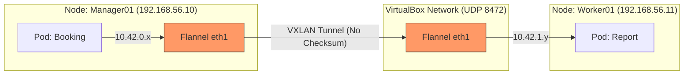

##  Обучающий Манифест: Выживание в Multi-node кластере
### Философия системы
Развертывание на локальных виртуальных машинах (Vagrant) требует ручного управления сетевым стеком. Мы заставляем **k3s** игнорировать стандартные NAT-интерфейсы в пользу выделенных приватных сетей, обеспечивая честный **Pod-to-Pod** трафик.

---

## ️ 1. Архитектурный фундамент
### Почему возникали проблемы?
* **k3s (Standard):** Пытается быть слишком умным. Находит первый попавшийся интерфейс (`eth0`), который в Vagrant всегда имеет IP `10.0.2.15`. В итоге все ноды думают, что они — один и тот же хост.
* **Flannel (VXLAN):** Инкапсулирует трафик подов в UDP-пакеты. VirtualBox по умолчанию портит контрольные суммы этих пакетов при передаче между VM.
* **Resource Management:** Java (Spring Boot) — прожорливая среда. 1 CPU на мастере вызывает каскадное зависание всей ОС при старте кластера.

---

##  2. Магия связности: Исправленный Provisioning
Ключевые параметры запуска для изоляции трафика на `eth1` (Host-only).

### Параметры запуска (The "Fix" Flags):
1.  `--node-ip`: Явное указание IP ноды в приватной сети.
2.  `--flannel-iface`: Принудительная привязка сетевой фабрики к `eth1`.
3.  `ethtool -K eth1 tx off`: Отключение аппаратного ускорения для предотвращения битых UDP-пакетов.

### Жизненный цикл пакета (VXLAN Path):
* **Pod A (Node 1)**  **Flannel Interface**  **VXLAN Encapsulation** (UDP 8472).
* **Host Interface (eth1)**  **VirtualBox Internal Network**  **Target Node (eth1)**.
* **Kernel Checksum Validation**: Если `tx off` не сделан, пакет дропается здесь.
* **Decapsulation**  **Pod B (Node 2)**.

---

## ️ 3. Разбор ошибок (Code Review)

###  Ошибка №1: Отсутствие явного интерфейса на Мастере
В первом скрипте мастера не было `--flannel-iface=eth1`.
**Последствие:** Мастер видел воркеров, но воркеры не могли достучаться до подов мастера, так как трафик уходил в "черную дыру" NAT-интерфейса.

###  Ошибка №2: Ресурсный голод (Soft Lockup)
Запуск `k3s` + `Postgres` + `Java Apps` на 1 CPU.
**Критическое состояние:** Ядро Linux блокируется на 70+ секунд (`watchdog: BUG: soft lockup`). Система перестает отвечать на любые команды (включая `Ctrl+C`), так как планировщик задач не может прервать процесс инициализации k3s.

---

##  4. Визуализация сетевых потоков (Mermaid)

---

##  5. Словарь Hardcore DevOps

| Термин | Описание |
| :--- | :--- |
| **Soft Lockup** | Состояние, когда поток ядра занимает CPU слишком долго, не давая работать другим. |
| **TX Offloading** | Передача расчета контрольных сумм сетевой карте. В виртуализации часто ломает инкапсулированный трафик. |
| **Internal-IP** | Адрес, по которому ноды кластера общаются между собой (Kubelet <-> API Server). |
| **Advertisement Address** | IP, который мастер транслирует в кластер для подключения воркеров. |

---

##  6. Чек-лист: Road to Stability
1.  **Интерфейсы:** Убедиться, что `--flannel-iface=eth1` прописан **везде** (и на мастере, и на воркерах).
2.  **Сетевой фикс:** Выполнить `ethtool -K eth1 tx off` на каждой ноде.
3.  **Лимиты Vagrant:** Минимум `vb.cpus = 2` и `vb.memory = 4096` для мастер-ноды.
4.  **Порядок деплоя:** Базы (Postgres/Rabbit)  Пауза (Ready 1/1)  Java-сервисы по одному.
5.  **Валидация:** Проверить пинг между подами командой `kubectl exec`.

---

##  7. Вопросы для самопроверки (Peer-Review)

* **Вопрос:** Почему `kubectl get nodes` может показывать статус `Ready`, но поды все равно не пингуются?
    * **Ответ:** Потому что статус `Ready` означает только то, что `kubelet` на связи с API-сервером. Это не гарантирует работу сетевого плагина (CNI/Flannel) или отсутствие блокировок на уровне фаервола/интерфейса.
* **Вопрос:** Что делать, если после перезагрузки виртуалки сеть снова упала?
    * **Ответ:** Проверить состояние `ethtool`. Настройки `tx off` не сохраняются после перезагрузки автоматически, их нужно прописывать в скрипты инициализации интерфейса или в `crontab @reboot`.