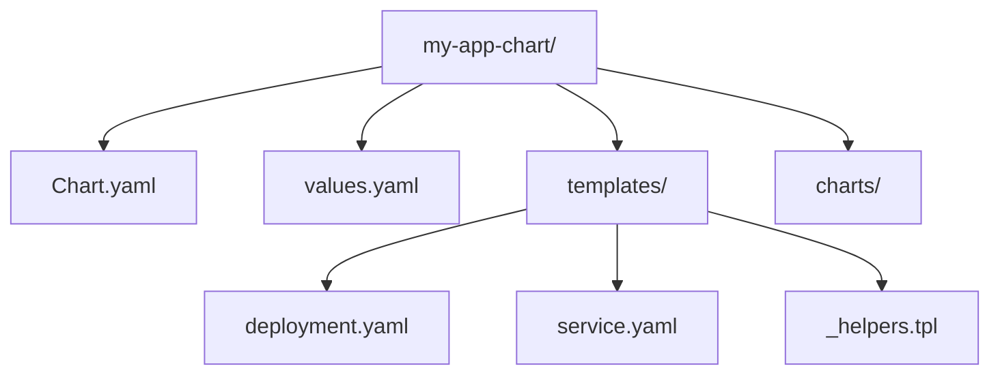

---
tags:
  - kubernetes
  - helm
  - devops
  - package-manager
  - automation
source: "Helm Documentation & Cloud Native Computing Foundation (CNCF)"
status: ️ Architecture-Guide
date: 2026-04-10
---

# ⎈ Helm: От Нуля до Архитектора

> [!abstract] Определение
> **Helm** — это менеджер пакетов для Kubernetes. Он позволяет упаковывать, версионировать и распространять сложные K8s-приложения. В Helm 3 была удалена серверная часть (Tiller), что сделало инструмент безопасным и "клиент-центричным".

---

## 1. Архитектура Helm 3: Безопасность и Релизы

В отличие от Helm 2, версия 3 полностью полагается на **RBAC пользователя** в `kubeconfig`.


* **Client-side**: Вся логика рендеринга на стороне CLI.
* **Storage**: Состояние релизов хранится в **Secrets** внутри того же Namespace, где стоит приложение.
* **Ревизии**: Каждое изменение (`upgrade`) создает новую версию секрета, что позволяет делать мгновенный `rollback`.

### Аналогии
| Понятие Helm | Аналогия (Linux) | Смысл |
| :--- | :--- | :--- |
| **Chart** | Пакет (.deb / .rpm) | Архив с шаблонами и дефолтными настройками. |
| **Values** | /etc/app.conf | Файл с параметрами под конкретную среду. |
| **Release** | Установленная программа | Конкретный экземпляр чарта в кластере. |
| **Repository** | APT / YUM Repo | Сервер (HTTP/OCI), где лежат версии чартов. |

---

## 2. Анатомия чарта




* **`Chart.yaml`**: Метаданные (версия чарта vs версия приложения).
* **`values.yaml`**: "Контракт" — все переменные, которые может менять инженер.
* **`templates/`**: YAML-манифесты с вставками Go Templates.
* **`_helpers.tpl`**: Именованные шаблоны (partial), переиспользуемая логика.

---

## 3. Go Templates: Логика шаблонизации

Helm использует мощный движок шаблонов. Основные объекты:
* `.Values`: Доступ к `values.yaml`.
* `.Release`: Метаданные (Name, Namespace, Revision).
* `.Chart`: Данные из `Chart.yaml`.

### Пример: Условная генерация портов
```yaml
spec:
  ports:
  {{- range .Values.service.ports }}
  - name: {{ .name }}
    port: {{ .external }}
    targetPort: {{ .internal }}
    protocol: TCP
  {{- end }}
```

> [!warning] Indent vs Nindent
> Всегда используй `nindent`. Он добавляет новую строку **перед** отступом, что критично для корректного YAML при использовании `if/else`.

---

## 4. Продвинутые возможности (PRO)

### Жизненный цикл и Hooks


* **Hooks**: Позволяют запускать Job до (`pre-install`) или после (`post-upgrade`) деплоя. Идеально для миграций БД.
* **Library Charts**: Чарты без ресурсов, содержащие только общую логику (define) для соблюдения **DRY**.
* **Helm Test**: Пост-деплой проверка (проверка эндпоинтов).

---

## 5. CLI и Эксплуатация

### Стандарт CI/CD пайплайна
В автоматизации используй именно эту связку флагов:
`helm upgrade --install --atomic --wait --history-max 5 <name> ./chart`

* `--atomic`: Авто-откат при неудаче.
* `--wait`: Ожидание готовности подов (Readiness Probes).
* `--history-max`: Ограничение количества секретов релиза (чтобы не забивать кластер).

### Отладка (Troubleshooting)
1. `helm lint`: Проверка синтаксиса.
2. `helm template --debug`: Рендеринг в терминал без деплоя.
3. `helm install --dry-run`: Проверка валидности манифестов на стороне K8s API.

---

## 6. Безопасность и GitOps


### Управление секретами
1. **HashiCorp Vault**: Инъекция секретов через Sidecar.
2. **Helm Secrets (SOPS)**: Шифрование `secrets.yaml` в Git. Расшифровка происходит "на лету" во время `helm install`.

### Хранение
Современный стандарт — **OCI Репозитории**. Чарты хранятся там же, где и Docker-образы (Harbor, GitLab Registry, AWS ECR).
`helm push my-chart-0.1.0.tgz oci://my-registry.io/charts`

---

## 7. Helm vs Kustomize: Когда что?

| Кейс | Helm | Kustomize |
| :--- | :--- | :--- |
| **Стороннее ПО** (Kafka, Prometheus) |  Да (Industry Standard) |  Нет |
| **Сложная логика** (циклы, условия) |  Да |  Нет |
| **Свои микросервисы** (простые) | ️ Избыточно |  Да (Overlays) |
| **GitOps прозрачность** | ️ Средняя (шаблоны) |  Высокая (чистый YAML) |