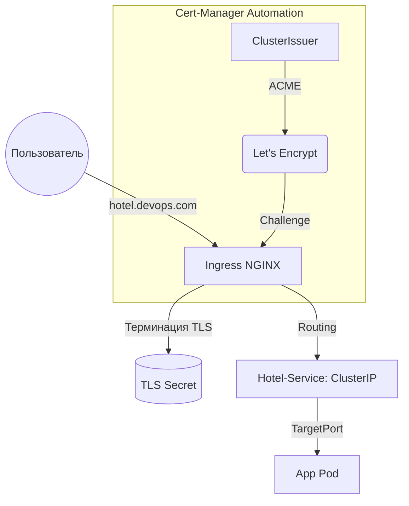

#  Обучающий Манифест: Современный K8s-стек

> [!ABSTRACT] Философия системы
> Мы используем **k3s** как легковесный фундамент, **Ingress-NGINX** как "умный шлюз" и **Cert-Manager** для автоматизации доверия. Это баланс между мощностью и эффективностью.

---

## ️ 1. Архитектурный фундамент

### Почему именно эти компоненты?
* **k3s**: Сертифицированный K8s без "жира". Идеален для Edge-вычислений и учебных проектов (бинарник < 70 МБ).
* **Ingress-NGINX**: Наш "дорожный полицейский". Вместо аренды 7+ публичных IP, мы используем **один входной узел**, экономя бюджет.
* **Cert-Manager**: Исключает риск "протухания" SSL. Полная автоматизация X.509 сертификатов.

---

##  2. Магия SSL: Протокол ACME
Автоматизация через `issuer.yaml` и Let's Encrypt.

### Пошаговый путь выпуска (ACME Challenge):
1. **Ingress**: Видит аннотацию `cluster-issuer`  создает объект `Certificate`.
2. **Order**: Формируется заказ в Let's Encrypt.
3. **HTTP-01 Challenge**: 
    * Cert-Manager создает эфемеровый (временный) Pod.
    * Let's Encrypt проверяет токен по пути `/.well-known/acme-challenge/`.
    * После валидации Pod удаляется (**Cleanup**).

> [!INFO] Жизненный цикл
> Секретные ключи генерируются **внутри** кластера. Это соответствует высшим стандартам безопасности (PKI).

---

## ️ 3. Разбор ошибок (Code Review)

###  Ошибка №1: NodePort в сервисах
В `hotel-service.yml` указан `type: NodePort`. 
> [!CAUTION] Почему это плохо?
> Это открывает случайный порт на всех нодах. При наличии Ingress сервис должен быть **ClusterIP**. NodePort увеличивает поверхность атаки.

###  Ошибка №2: Wildcard vs HTTP-01
В `ingress.yml` указан `*.devops.com`.
> [!DANGER] Критическое несоответствие
> Метод **HTTP-01** не поддерживает Wildcard-домены. Для "звездочки" обязателен метод **DNS-01**. Сейчас выпуск сертификата зависнет.

---

##  4. Визуализация потоков данных (Mermaid)

##  5. Словарь Hardcore DevOps
|**Термин**|**Описание**|
|---|---|
|**Annotation**|Инструкции для контроллеров (например, какой Issuer использовать).|
|**ClusterIssuer**|Глобальный ресурс для выпуска SSL (не привязан к Namespace).|
|**TLS Secret**|Объект, хранящий пару `tls.key` и `tls.crt`.|
|**RollingUpdate**|Плавная замена подов без простоя (Downtime).|

##  6. Чек-лист: Road to Production
- [x] **Изоляция**: Заменить `NodePort` на `ClusterIP` во всех сервисах.
- [x] **Связь**: Добавить аннотацию `cert-manager.io/cluster-issuer: "letsencrypt"` в Ingress.
- [x] **Фикс TLS**: Либо заменить `*.devops.com` на конкретные хосты, либо внедрить **DNS-01**.
- [x] **Security**: Добавить аннотацию `ssl-redirect: "true"` для форсирования HTTPS.

##  7. Вопросы для самопроверки (Peer-Review)

> [!QUESTION] Вопрос для размышления Как Ingress понимает, какому сервису отправить пакет, если оба домена (`hotel` и `booking`) ведут на один IP балансировщика? _Ответ: На основе заголовка `Host` в HTTP-запросе._

> [!QUESTION] Что будет, если удалить секрет вручную? _Ответ: Ingress начнет отдавать "Fake Certificate", пока Cert-Manager автоматически не перевыпустит новый._