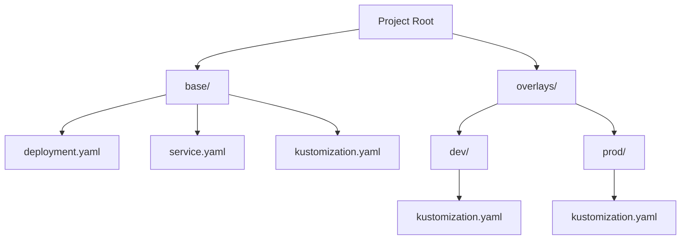

---
tags:
  - kubernetes
  - kustomize
  - gitops
  - infrastructure-as-code
source: "SIG-CLI Kustomize Deep Dive"
status:  PRO-Guide
date: 2026-04-10
---

# ️ Kustomize: От Новичка до PRO

> [!abstract] Философия
> **Kustomize** — это "template-free" инструмент. В отличие от Helm, он не вырезает дырки в YAML (шаблонизация), а накладывает слои (**Configuration Hydration**). Это обеспечивает чистоту манифестов и исключает ошибки синтаксиса при подстановке строк.

---

## 1. Стратегическое сравнение: Kustomize vs Helm

| Критерий | Helm (Templating) | Kustomize (Patching) |
| :--- | :--- | :--- |
| **Подход** | "Черный ящик" (Go Templates) | Прозрачный YAML (Native) |
| **Состояние** | Хранит релизы в кластере (Secrets) | Stateless (только генерация) |
| **Сложность** | Высокая (свой DSL) | Низкая (чистый K8s API) |
| **Предсказуемость** | Зависит от логики чарта | Всегда валидный K8s объект |

---

## 2. Архитектура: Base и Overlays

Для устранения **Configuration Drift** мы разделяем общее (Base) и частное (Overlays).

### Структура проекта


> [!important] Modern Standard
> Поле `bases: []` — **DEPRECATED**. Используй единый список `resources: []` для файлов и путей к директориям.

---

## 3. Генераторы: ConfigMap и Secrets

Kustomize решает проблему "зависших конфигов" через автоматический хеш.

```yaml
configMapGenerator:
- name: app-config
  literals:
    - LOG_LEVEL=info
  files:
    - configs/config.properties
```

> [!tip] PRO-Нюанс: Hashing
> Kustomize добавляет хеш к имени (напр. `app-config-f76cf87`). Он **автоматически** обновляет все ссылки на этот ConfigMap в Deployment. Это гарантирует запуск **Rolling Update** при каждом изменении конфига.

---

## 4. Трансформаторы (Transformers)

Это "Kubernetes-aware" операции, которые понимают контекст.

* **`commonLabels`**: Обновляет не только метаданные, но и `spec.selector` в Service и Deployment.
* **`namePrefix` / `nameSuffix`**: Позволяет изолировать ресурсы (напр. `dev-my-app`).
* **`images`**: Декларативная смена тегов для CI/CD.
    ```yaml
    images:
      - name: my-app-image
        newName: my-registry/my-app
        newTag: v1.2.3
    ```

---

## 5. Продвинутый патчинг

Когда трансформаторов мало, в ход идут патчи.

### Strategic Merge vs JSON 6902
1.  **Strategic Merge**: Сливает YAML по ключу (напр. по имени контейнера).
2.  **JSON 6902**: Точечное воздействие (add, replace, remove).

**Пример JSON 6902 (Масштабирование):**
```yaml
patches:
- target:
    kind: Deployment
    name: go-app
  patch: |-
    - op: replace
      path: /spec/replicas
      value: 5
```

---

## 6. Компоненты и Replacements (PRO)

* **Components**: Механизм "миксинов" (`kind: Component`). Позволяет подключать sidecar-контейнеры или HPA как плагины.
* **Replacements**: Современная замена `vars`. Позволяет копировать значения между полями (напр. передать имя Service в ENV пода).

---

## 7. Командный справочник

### Kustomize CLI
* `kustomize create` — Инициализация.
* `kustomize build .` — Рендеринг (основной дебаг).
* `kustomize edit set image ...` — Обновление тега из CI-пайплайна.

### Интеграция с kubectl
Флаг `-k` делает kubectl "Kustomize-native":
* `kubectl apply -k overlays/prod`
* `kubectl diff -k overlays/dev` (посмотреть изменения перед деплоем).

### Версии в kubectl
| Версия K8s | Версия Kustomize |
| :--- | :--- |
| **1.21** | v4.0.5 |
| **1.27+** | v5.0.1+ (современный стандарт) |

---

## 8. Troubleshooting (Решение проблем)

1.  **Патч не применяется?** Проверь соответствие `group`, `version`, `kind` и `name`. Любое расхождение в GVKN — и Kustomize проигнорирует цель.
2.  **Конфликт селекторов?** `commonLabels` перезаписывают селекторы. Если это ломает логику, используй `includeSelectors: false`.
3.  **Hybrid Approach?** Если нужно кастомизировать сторонний Helm-чарт:
    `helm template ... > base.yaml` → используй его как ресурс в Kustomize.