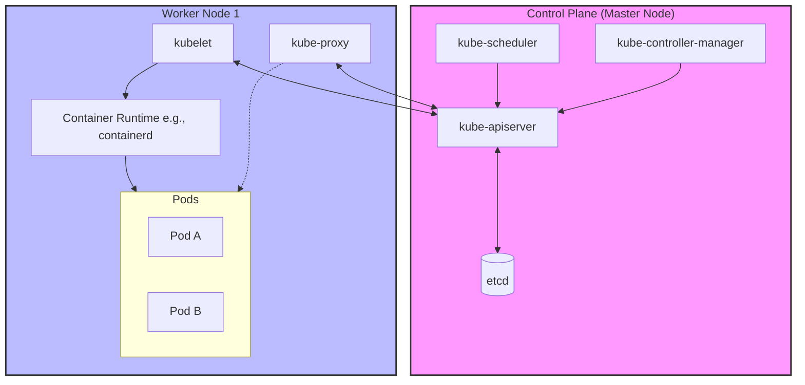

### Схема компонентов Kubernetes (Mermaid)
Фрагмент кода

### Краткий Summary: Кто где живет и зачем нужен

#### Control Plane (Master-нода) — «Мозг» кластера

Здесь работают компоненты, которые управляют состоянием всего кластера. На обычных рабочих нодах их, как правило, нет.

- **[[Kubeapi]]**: Главные ворота кластера. Все компоненты (и ты через `kubectl`) общаются исключительно с ним. Он валидирует и настраивает данные для объектов (pods, services, и т.д.).
    
- **[[ETCD]]**: Надежное распределенное хранилище «ключ-значение». Здесь лежит **абсолютно всё** состояние кластера. Если данных нет в etcd — их нет в Kubernetes.
    
- **[[Kube-scheduler]]**: «Грузчик-логист». Он смотрит на новые поды, у которых не назначен узел, оценивает ресурсы (CPU/RAM) на Worker-нодах и решает, на какую именно ноду отправить под.
    
- **[[Kube-controller-manager]]**: «Регулятор порядка». Запускает фоновые контроллеры, которые следят за состоянием кластера. Например, если упал под, _Node Controller_ замечает это, а _Replication Controller_ дает команду создать новый, чтобы поддерживать нужное количество копий.
    

#### Worker Nodes (Рабочие ноды) — «Руки» кластера

Эти компоненты крутятся на **каждой** машине, где физически запускаются твои контейнеры и приложения.

- **[[Kubelet]]**: «Старший по подъезду» на конкретной ноде. Он принимает от `kube-apiserver` инструкции (PodSpecs) и следит за тем, чтобы описанные контейнеры были запущены и работали исправно. Если контейнеру плохо — kubelet его перезапустит.
    
- **[[Kubeproxy]]**: «Сетевой регулировщик». Работает на каждой ноде. Он отвечает за сетевые правила (обычно через `iptables` или `IPVS`). Именно благодаря ему работает абстракция `Service` — он распределяет трафик, идущий на один IP-сервиса, по конкретным подам на разных нодах.
    
- **`Container Runtime`** (например, `containerd`, `CRI-O`): Движок, который физически скачивает образы и запускает контейнеры (kubelet сам по себе контейнеры разворачивать не умеет, он дает команду рантайму).
    

> **Суть в одном предложении:** Control Plane (`apiserver`, `etcd`, `scheduler`, `controllers`) решает, **что** и **где** должно работать, а Worker-ноды (`kubelet`, `kube-proxy`) берут эти инструкции и физически **крутят контейнеры и маршрутизируют трафик** на местах.