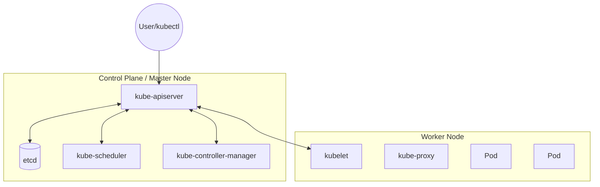

# ️ Kubernetes (K8s)

> [!info] **Kubernetes** — это мощный фреймворк для оркестрации контейнеров. 
> В отличие от Docker Swarm, K8s является более высокоуровневым решением, не привязанным жестко к среде выполнения Docker (поддерживает CRI — Container Runtime Interface).

---

## ️ Архитектура кластера
Кластер делится на две основные части: **Control Plane** (Master Node) и **Worker Nodes**.

### Визуализация структуры


![[k9s.png]]


### 1. Master Node (Control Plane)
Центральный «мозг» кластера.
*   **`kube-apiserver`**: Точка входа для всех запросов (через kubectl или API).
*   **`etcd`**: Надежное хранилище «ключ–значение» для всех данных кластера.
*   **`kube-scheduler`**: Выбирает, на каком узле запустить новый Pod.
*   **`kube-controller-manager`**: Следит за состоянием кластера (ноды, реплики, эндпоинты).

### 2. Worker Node
Узел, где непосредственно выполняются приложения.
*   **`kubelet`**: Агент, который следит, чтобы контейнеры в Pod'ах были запущены и здоровы.
*   **`kube-proxy`**: Сетевой помощник, обеспечивающий правила трансляции IP-адресов.

---

##  Основные объекты и абстракции

### Базовые единицы
*   **Pod**: Минимальная единица. «Контейнер для контейнеров». Общий сетевой стек и тома. 
    > [!warning] IP-адрес Pod'а динамический и меняется при каждом перезапуске!
*   **Service**: Стабильный IP и DNS-имя. Выполняет роль балансировщика трафика между группой Pod'ов.
*   **Namespace**: Виртуальная изоляция ресурсов внутри одного кластера (например, `prod`, `dev`, `stage`).
*   **Volume**: Механизм хранения данных, переживающий перезапуск контейнеров.

### Контроллеры управления
| Объект | Назначение |
| :--- | :--- |
| **Deployment** | Декларативное управление обновлениями и количеством реплик. |
| **StatefulSet** | Для приложений с состоянием (БД). Гарантирует уникальность имен и стабильность хранилищ. |
| **ReplicaSet** | (Внутри Deployment) Следит, чтобы всегда работало заданное количество копий Pod. |

### Сеть и конфигурация
*   **Ingress**: Точка входа в кластер извне (HTTP/HTTPS). Правила маршрутизации, SSL-терминация.
*   **ConfigMap**: Хранение открытых настроек (переменные окружения, файлы конфигов).
*   **Secret**: Хранение зашифрованных данных (пароли, токены, ключи).

---

## ️ Интерфейс командной строки: `kubectl`

Kubectl взаимодействует с **API Server** по протоколу HTTP REST.

### Популярные команды
> [!example] Шпаргалка
> - `kubectl config view` — посмотреть текущий конфиг доступа.
> - `kubectl get pods` — список всех подов в текущем namespace.
> - `kubectl apply -f manifest.yaml` — создать/обновить ресурс из файла.
> - `kubectl logs <pod_name>` — просмотр логов приложения.
> - `kubectl exec -it <pod_name> -- bash` — провалиться внутрь контейнера.
> - `kubectl scale deployment <name> --replicas=5` — быстрое масштабирование.

---

##  Анатомия манифеста (YAML)

Манифест описывает **желаемое состояние** объекта. Kubernetes постоянно сверяет текущее состояние с этим файлом.

```yaml
apiVersion: apps/v1        # Версия API
kind: Deployment           # Тип ресурса
metadata:
  name: my-app-deploy      # Имя объекта
  labels:
    app: backend           # Метки для поиска и связки
spec:
  replicas: 3              # Сколько копий запустить
  selector:
    matchLabels:
      app: web-server      # Кого именно считать репликами этого деплоймента
  template:                # Шаблон самого Pod'а
    metadata:
      labels:
        app: web-server
    spec:
      containers:
      - name: nginx-container
        image: nginx:1.21
        ports:
        - containerPort: 80
```