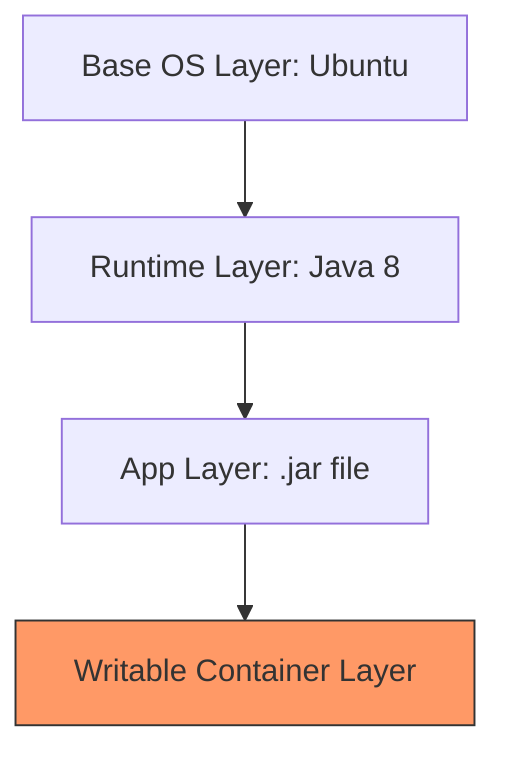

---
tags:
  - docker
  - kubernetes
  - orchestration
  - architecture
  - devops
source: "Learning Path: Puppet, Docker, and Kubernetes"
status:  Production-Ready
date: 2026-04-10
---

#  Контейнеризация и оркестрация: От Docker до Kubernetes

> [!abstract] Архитектурная парадигма
> Переход от "хрупких" серверов к **Phoenix Servers** — системам, которые уничтожаются и воссоздаются из кода в идентичном состоянии. Контейнеризация — это фундамент воспроизводимости в CD-пайплайне.

---

## 1. Сравнение: VM vs Containers

| Характеристика | Virtual Machines (VM) | Containers (LXC/Docker) |
| :--- | :--- | :--- |
| **Изоляция** | На уровне железа (Гипервизор) | На уровне ядра ОС |
| **ОС** | Полная гостевая ОС в каждой VM | Общее ядро хоста |
| **Вес** | Гигабайты | Мегабайты |
| **Скорость запуска** | Минуты | Секунды |


---

## 2. Docker: Глубокое погружение

### Слоистая структура (Layer-based FS)
Docker-образы состоят из неизменяемых слоев. Это позволяет кэшировать общие части и передавать только "дельты".



### Best Practices для Dockerfile
> [!tip] Оптимизация сборки
> Размещайте инструкции так, чтобы **наиболее часто меняющиеся слои** (код приложения) были в конце. Это максимизирует использование кэша.

```dockerfile
FROM java:8 # Конкретная версия для воспроизводимости
COPY target/app-0.0.1.war app.war # Слой приложения (меняется часто)
CMD ["java", "-Dlogging.path=/log/", "-jar", "app.war"]
EXPOSE 8080
```

* **Volumes (-v)**: Критически важны для *Stateful* данных (логи, БД), так как сам контейнер **Immutable**.
* **Networking (-p)**: Проброс портов связывает изолированный процесс с внешним миром.

---

## 3. Kubernetes: Оркестрация масштаба

Kubernetes (K8s) управляет **Целевым состоянием (Target State)** системы, автоматически восстанавливая поды при сбоях.

### Основные объекты K8s
* **Pod**: Атомарная единица (группа контейнеров с общим IP).
* **Service**: Стабильный эндпоинт и балансировщик нагрузки.
* **Deployment**: Управляет версиями и **Rolling Updates** (обновление без простоя).


### Пример манифеста (Deployment)
```yaml
apiVersion: apps/v1
kind: Deployment
metadata:
  name: user-reg-deploy
spec:
  replicas: 3
  selector:
    matchLabels:
      app: registration
  template:
    metadata:
      labels:
        app: registration
    spec:
      containers:
      - name: app
        image: user-registration:v2 # Новая версия
        ports:
        - containerPort: 8080
```

---

## 4. Сравнение систем оркестрации

| Критерий | Kubernetes | Docker Swarm | CoreOS (fleetd) |
| :--- | :--- | :--- | :--- |
| **Сложность** | Высокая | Низкая | Средняя |
| **Масштаб** | Экстремальный | Средний | Высокий |
| **Философия** | Target State | Простота Docker | Cluster-as-a-resource |

> [!warning] Запрет на Manual Patching
> Любое изменение в работающем контейнере ("ручной патч") ведет к **Configuration Drift**. В мире контейнеров мы правим код (Dockerfile/Manifest) и пересоздаем инфраструктуру заново.

---

## 5. Итоги для архитектора
1.  **Immutable Infrastructure**: Если нужно обновить систему — уничтожьте старую и создайте новую.
2.  **Infrastructure as Code**: Манифесты K8s и Dockerfile должны лежать в Git.
3.  **Data Persistence**: Главный вызов — отделение кода от данных через Volumes и управление миграциями схем БД.