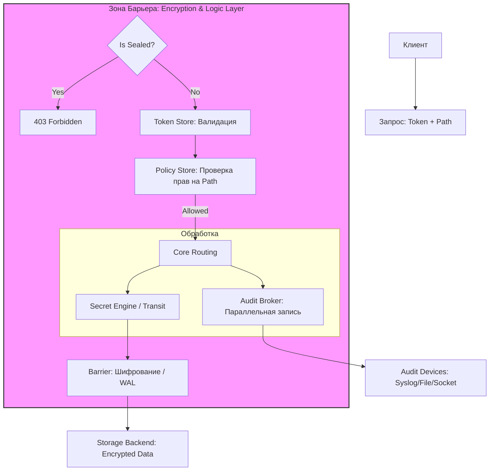

---
tags:
  - security
  - vault
  - hashicorp
  - devops
  - architecture
date: 2026-08-08
aliases:
  - HashiCorp Vault Architecture
  - Vault System Design
---

# Архитектура HashiCorp Vault: Системный дизайн и внутреннее устройство

> [!abstract] Краткое содержание
> Комплексный разбор архитектуры HashiCorp Vault: устройство криптографического барьера, бэкенды хранения, жизненный цикл с распечатыванием (Unsealing), модульные подсистемы и ключевые принципы обеспечения безопасности по стандартам Zero Trust.

---

## 1. Обзор высокоуровневой архитектуры (High-Level Architecture)

В условиях современной микросервисной инфраструктуры организации неизбежно сталкиваются с проблемой **«разрастания секретов» (*secret sprawl*)**. Учетные данные, API-ключи и сертификаты оказываются распределены по исходному коду, конфигурационным файлам и CI/CD-пайплайнам. HashiCorp Vault решает эту проблему, выступая как *Single Source of Truth*, спроектированный на принципах Zero Trust и минимизации доверия к среде исполнения.

### Концепция защитного Барьера (Barrier)
Центральным элементом архитектуры является **Барьер**. Это криптографический периметр, который можно сравнить с сейфом. Внутри Барьера данные находятся в открытом виде (в оперативной памяти), но любая информация, покидающая этот периметр для записи на диск, принудительно шифруется.

Система разделена на три логических слоя:
1. **Клиентский слой:** Взаимодействие через HTTP API, CLI или UI.
2. **Ядро/Барьер (Vault Core):** Слой, где происходит проверка политик, управление токенами и, что критично, сама логика шифрования.
3. **Хранилище (Storage Backend):** Внешний уровень персистентности.

> [!note] Слой «So What?»
> Такое разделение позволяет Vault функционировать в недоверенных облачных средах. Поскольку Storage Backend является «глупым» (*untrusted*) и получает от Барьера только зашифрованные байты, компрометация физического носителя или административного доступа к облачному диску не ведет к утечке секретов. Безопасность всей системы сводится к защите ключей, открывающих Барьер.

---

## 2. Бэкенды хранения данных и целостность (Storage Backends)

Уровень хранения отвечает исключительно за долговечность данных. Согласно спецификации, Storage Backend никогда не видит ключей расшифрования и не участвует в логике обработки запросов.

### Выбор бэкенда: Интеграция против Внешних систем
* **Integrated Storage (Raft):** Современный стандарт. Raft встроен непосредственно в Vault, что устраняет внешние зависимости, упрощает эксплуатацию и обеспечивает консистентность данных. С точки зрения DevOps, это значительно снижает операционную сложность.
* **Внешние решения (Consul, SQL):** Требуют управления отдельным кластером. Хотя Consul исторически популярен, он увеличивает количество «движущихся частей» в архитектуре.

### Data Integrity: WAL и Rollback Manager
Для обеспечения надежности Vault использует механизмы, характерные для СУБД: **Write-Ahead Logging (WAL)** и **Rollback Manager**. Это гарантирует, что даже при частичных сбоях или внезапной остановке сервера состояние данных останется консистентным, а незавершенные транзакции будут корректно обработаны при перезапуске.

---

## 3. Жизненный цикл и криптографическая безопасность

При запуске сервер Vault всегда находится в состоянии **«Запечатано» (Sealed)**. В этом режиме он не может расшифровать данные в хранилище, так как мастер-ключ не загружен в память.

### Механизмы распечатывания (Unsealing)
* **Алгоритм Шамира (Shamir's Secret Sharing):** Классический метод, при котором Master Key (Root Key) разбивается на части (*Key Shares*). Для оживления системы требуется кворум (например, 3 из 5 держателей ключей). Это реализует принцип разделения ответственности и защищает от инсайдерских угроз.
* **Auto-Unseal (KMS/HSM):** Рекомендованный путь для высокоавтоматизированных сред. Vault делегирует хранение ключа облачному провайдеру (AWS KMS, Azure Key Vault) или аппаратному модулю (HSM). Это исключает ручной труд при перезагрузке узлов и соответствует промышленным стандартам безопасности.

> [!tip] Слой «So What?»
> Пороговое разделение или использование внешних KMS гарантирует, что кража самого сервера или образа диска не даст злоумышленнику доступа к данным. Без процедуры Unseal Барьер остается закрытым, а ключи шифрования данных — недоступными.

---

## 4. Основные подсистемы (Core Subsystems)

Ядро Vault — это модульный фреймворк, где безопасность строится на иерархической, путевой логике (*path-based logic*), напоминающей виртуальную файловую систему.

* **Auth Methods:** Обменивают внешнюю идентичность (Kubernetes Service Account, LDAP, GitHub) на внутренний **Client Token**.
* **Token Store:** Хранилище сессий внутри Барьера. Токены — это «куки» Vault, определяющие время жизни доступа (TTL).
* **Policies:** Декларативные правила ACL, ограничивающие доступ к путям (например, `secret/data/teams/*`). Vault следует принципу *Deny by Default*.
* **Secret Engines:**
  * **Статические (KV):** Хранение пар ключ-значение.
  * **Динамические:** Генерация on-demand краткосрочных учетных данных для БД или AWS.
  * **Transit (Encryption as a Service):** Криптография без хранения. Позволяет приложениям шифровать данные, не видя самих ключей.

> [!important] Слой «So What?»
> Внедрение движка Transit и динамических секретов кардинально меняет парадигму безопасности. Приложения перестают быть «хранителями» ключей, что минимизирует «радиус поражения» (*blast radius*). Если приложение скомпрометировано, злоумышленник не найдет в нем долгоживущих паролей, а динамический доступ будет отозван автоматически.

---

## 5. Визуализация: Путь запроса в архитектуре Vault

Ниже приведена схема прохождения запроса через уровни безопасности Vault Core.

---

## 6. Резюме и лучшие практики

Понимание архитектуры Vault критично для построения систем, устойчивых к комплаенс-проверкам (PCI DSS, SOC2) в регулируемых индустриях.

### Архитектурные выводы:

* **Lease Management (Управление арендой):** Основа динамической инфраструктуры. Каждый секрет имеет срок жизни. Если клиент не продлил аренду, Vault автоматически удалит учетную запись в целевой системе.
* **Audit Broker как блокирующий шаг:** Vault спроектирован так, что запрос не будет выполнен, если его невозможно залогировать хотябы в одно обязательное устройство аудита. Это гарантирует полноту следственного хвоста.
* **Иерархия путей:** Использование масок (`+`, `*`) в политиках позволяет строить масштабируемые ролевые модели для тысяч микросервисов.
* **Отход от статики:** Максимальное использование динамических секретов и Transit API сводит риск утечки данных к минимуму, превращая безопасность из административной обузы в автоматизированный процесс.