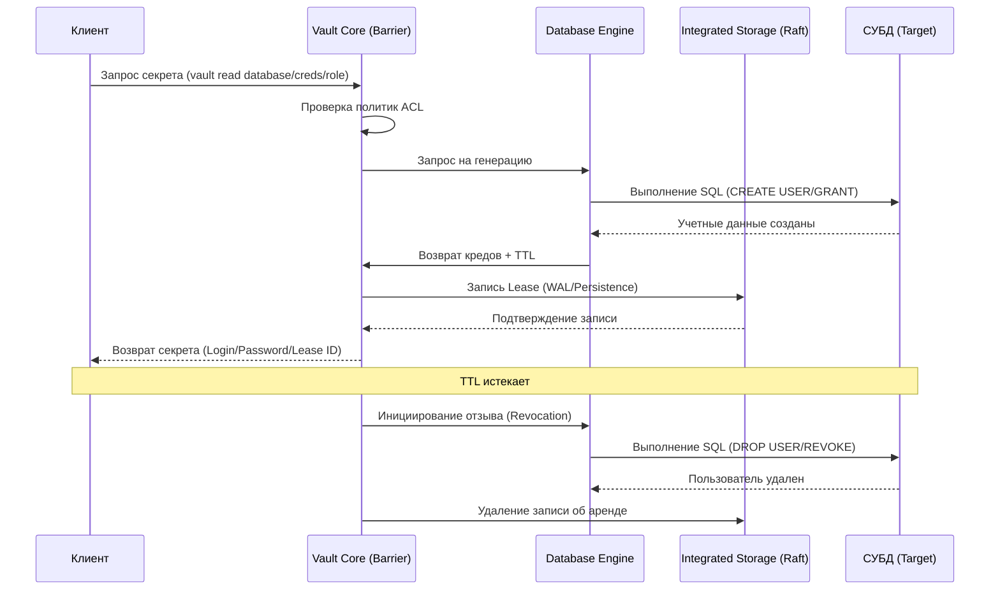

---
tags:
  - vault
  - security
  - dynamic-secrets
  - devops
  - architecture
date: 2026-08-08
aliases:
  - Dynamic Secrets
  - JIT Provisioning
  - Vault Architecture
---

# Динамические движки секретов в HashiCorp Vault: Глубокое погружение

> [!abstract] Краткое содержание
> Эволюция от статических учетных данных к Just-In-Time (JIT) Provisioning: архитектура криптографического барьера Vault, автоматизация генерации доступов через Database, PKI и Cloud Secrets Engines, а также минимизация радиуса поражения (Blast Radius) в рамках концепции Zero Trust.

---

## 1. Концептуальный сдвиг: От статических секретов к Just-In-Time (JIT)

В традиционных Enterprise-средах секреты часто представляют собой статическую константу: пароль администратора СУБД или API-ключ, живущий годами. Это неизбежно ведет к **«разрастанию секретов» (*secret sprawl*)**, когда учетные данные утекают в логи, конфигурации или код. Наш путь к Zero Trust начинается не с простого хранения, а с **Discovery** — использования инструментов вроде Vault Radar для обнаружения существующих утечек, что является обязательным пререквизитом перед переходом к парадигме **Just-In-Time (JIT) Provisioning**.

Стратегическая ценность динамических секретов заключается в отказе от владения ключом в пользу его краткосрочной аренды. Механика **Lease Management** (управление арендой) и жесткие **TTL (Time-To-Live)** превращают доступ в «движущуюся мишень». Если статический пароль — это компрометация всей системы на неопределенный срок, то динамический секрет автоматически аннулируется через **Expiration Manager**, как только истекает время его аренды или выполняется принудительный отзыв (*revocation*).

> [!abstract] Just-In-Time Provisioning (JIT)
> Концепция предоставления прав доступа ровно в тот момент, когда они необходимы, на минимально требуемый срок, с автоматическим уничтожением учетных данных по завершении жизненного цикла.

Этот процесс опирается на внутренние механизмы безопасности ядра Vault, которые гарантируют целостность данных даже в недоверенной среде.

---

## 2. Архитектурный фундамент: Barrier, Storage и Shamir's Secret Sharing

Безопасность данных в Vault начинается с глубокой изоляции компонентов. Ядро системы оперирует внутри криптографического периметра — шифрующего слоя (**Barrier**).

* **Barrier и Storage:** Vault исходит из того, что внешнее хранилище (*Storage Backend*), такое как Integrated Storage (Raft) или Consul, является «недоверенной средой». Барьер не просто шифрует данные перед записью, но и выполняет их верификацию при чтении. Взаимодействие с барьером контролируют **Audit Broker** (обеспечивающий логирование) и **Rollback Manager** (управляющий частичными отказами).
* **Иерархия ключей и Shamir's Secret Sharing:** При инициализации Vault генерирует **Root Key** (также называемый Master Key), который защищает Keyring (связку ключей), содержащий актуальные ключи шифрования данных (DEK). Сам Root Key зашифрован **Unseal Key**. Используя алгоритм Шамира, Unseal Key разбивается на части (*shards*). Только собрав кворум этих частей, можно восстановить Unseal Key, расшифровать Root Key и «распечатать» (*unseal*) Vault, переведя его в рабочее состояние.

> [!warning] Риски инициализации
> Утеря шардов мастер-ключа делает восстановление данных невозможным. В Enterprise-архитектурах критически важно использовать Cloud KMS или HSM для реализации механизма **Auto-Unseal**.

Надежная архитектура ядра позволяет безопасно внедрять специфические движки, выступающие брокерами доверия для внешних систем.

---

## 3. Database Secrets Engine: Автоматизация жизненного цикла учетных данных СУБД

Хранение паролей `sa` или `root` в CI/CD переменных — значимый фактор риска компрометации инфраструктуры. **Database Secrets Engine** устраняет этот риск, работая как RPC/API Proxy (брокер) между приложением и СУБД (PostgreSQL, MySQL, MongoDB).

Vault использует *connection plugins* для генерации временных пользователей на основе SQL-ролей. Процесс автоматизирован: приложение запрашивает доступ, Vault выполняет `CREATE USER` с ограниченными привилегиями, регистрирует аренду и возвращает креды приложению. По истечении TTL выполняется автоматический `DROP USER`. Если СУБД недоступна в момент отзыва, Rollback Manager будет повторять попытки до успешного завершения операции.

Включение движка выполняется командой:
```bash
vault secrets enable database

```

> [!tip] Принцип наименьших привилегий
> Используйте SQL-шаблоны ролей, ограничивающие область действия (*scope*) пользователя конкретными таблицами или схемами, чтобы минимизировать потенциальный ущерб.

---

## 4. PKI Secrets Engine: Превращение Vault в удостоверяющий центр (CA)

Управление сертификатами X.509 традиционно страдает от «ручного труда» и избыточных сроков жизни (5–10 лет). **PKI Secrets Engine** превращает Vault в программный Root или Intermediate CA, позволяя выпускать сертификаты за миллисекунды.

Это позволяет реализовать настоящий **mTLS (mutual TLS)** в Service Mesh. В отличие от традиционных CA, Vault позволяет устанавливать TTL сертификатов, измеряемые часами. Это делает ротацию автоматической и непрерывной, сводя на нет риск использования скомпрометированных ключей — они просто истекают быстрее, чем атакующий успеет ими воспользоваться.

---

## 5. Cloud Secrets Engines: Динамический доступ к AWS, GCP и Azure

Проблема «утечки облачных ключей» решается через **Cloud Secrets Engines**, которые заменяют долгоживущие `AWS_ACCESS_KEY_ID` на временные STS-токены или динамические сервисные аккаунты.

Отказ от статических ключей в пользу временных IAM-ролей радикально сужает возможности для горизонтального перемещения атакующего (*lateral movement*) в облаке. Vault интегрируется с нативными облачными ID (IAM Roles, Managed Identities), что позволяет сервисам проходить аутентификацию в Vault без использования каких-либо предварительных секретов.

> [!note] Доверенная идентификация
> Vault использует облачного провайдера как Identity Provider, проверяя метаданные сущности (инстанса или пода) перед выдачей временных токенов доступа.

---

## 6. Визуализация жизненного цикла динамического секрета

Sequence-диаграмма отражает взаимодействие компонентов, включая критически важный этап сохранения аренды в хранилище для обеспечения устойчивости.



Эта цепочка гарантирует, что даже при перезагрузке Vault, информация об активных арендах будет восстановлена из Raft и корректно обработана.

---

## 7. Архитектурный анализ: "So What?" слой и Compliance

Внедрение динамических движков секретов — это фундамент современной безопасности Enterprise-уровня.

* **Blast Radius (Радиус поражения):** Динамические секреты радикально сужают возможности злоумышленника. Уникальность учетных данных для каждого инстанса позволяет мгновенно локализовать точку компрометации (например, конкретный веб-сервер №42) и отозвать только его доступ, не вызывая простоя всей системы.
* **Compliance и Audit Broker:** Требования PCI DSS и SOC 2 по регулярной смене паролей выполняются автоматически. Audit Broker обеспечивает «неразрывный след» (*unbreakable audit trail*), направляя логи одновременно в несколько бэкендов (например, Splunk и Syslog), исключая возможность удаления записей даже администратором с правами `root`.

Vault выступает центральным звеном Zero Trust архитектуры, превращая безопасность из реактивной борьбы с инцидентами в автоматизированный и предсказуемый процесс управления доверием.

> [!abstract] Итоговый вывод
> Переход к динамическим секретам устраняет концепцию «вечных» прав доступа. Централизация управления в Vault обеспечивает прозрачность, мгновенный отзыв полномочий и полное соответствие самым жестким стандартам информационной безопасности.