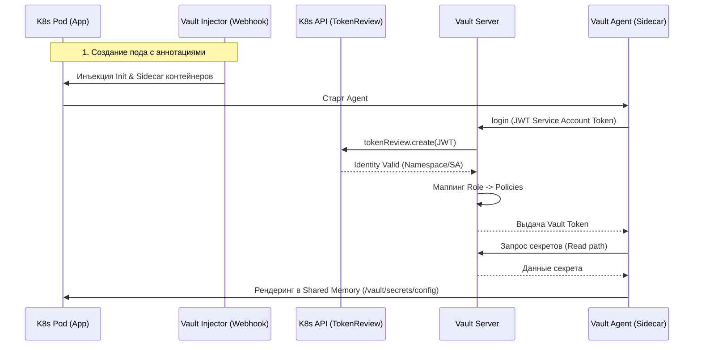

---
tags:
  - vault
  - kubernetes
  - devops
  - security
  - architecture
date: 2026-08-08
aliases:
  - Vault-K8s-Integration
  - Kubernetes-Secrets-Management
status: reference
---

# Интеграция HashiCorp Vault с Kubernetes: Архитектура и Безопасность

> [!abstract] Краткое содержание
> Глубокий технический разбор интеграции HashiCorp Vault с Kubernetes: преодоление Secret Sprawl, механика криптографического барьера, аутентификация через Kubernetes Auth Method, паттерн Vault Agent Injector и архитектурный анализ безопасности на принципах Zero Trust.

---

## 1. Введение: Проблема "Secret Sprawl" и стратегия централизации

В современных распределенных системах основной угрозой безопасности является **«расползание секретов» (*secret sprawl*)**. Учетные данные, API-ключи и TLS-сертификаты хаотично распределяются по инфраструктуре: они хранятся в открытом виде в исходном коде, конфигурациях CI/CD (например, переменные Jenkins или GitLab), тикетах Jira и сообщениях Slack. Это создает фрагментированную среду, где невозможно контролировать доступ, проводить аудит или оперативно ротировать скомпрометированные данные.

Переход от статических, небезопасно хранящихся учетных данных к централизованной модели управления — это переход от «безопасности периметра» (*network-based*) к **«безопасности на основе идентичности» (*identity-based*)**. HashiCorp Vault становится фундаментом этой стратегии, выступая как доверенный брокер аутентификации между клиентом и любым внешним сервисом.

> [!abstract] Vault как Single Source of Truth
> Vault устраняет Secret Sprawl, заменяя статичные секреты динамическими, краткоживущими учетными данными. Он обеспечивает шифрование данных «в покое» (*at rest*) и в транзите, предоставляя единую точку аудита для всей инфраструктуры.

Для успешной реализации этой модели необходимо понимать внутренний фундамент защиты Vault, на котором строится всё доверие в системе.

---

## 2. Фундаментальная архитектура защиты: Barrier и Shamir's Secret Sharing

Внутреннее устройство Vault спроектировано исходя из принципа нулевого доверия к уровню хранения. Основным компонентом является **Barrier** (защитный барьер) — программный слой, отделяющий логику ядра и API от Storage Backend (Consul, SQL, etcd). Все данные, покидающие барьер, шифруются; данные, поступающие внутрь, дешифруются и верифицируются.

Безопасность системы определяется её состоянием:
* **Sealed (Запечатано):** Состояние Vault по умолчанию при запуске. Vault имеет доступ к зашифрованному хранилищу, но не обладает ключами для дешифровки.
* **Unsealed (Распечатано):** Состояние, в котором Vault реконструирует ключи в памяти для начала работы.

Для защиты доступа используется алгоритм **Shamir's Secret Sharing**, разделяющий ключ на части (*shards*). Чтобы распечатать Vault, необходимо собрать кворум (*threshold*) из этих частей.

> [!note] Иерархия ключей в Vault
> Понимание иерархии критично для архитектора:
> * **Unseal Keys (Shards):** Части, распределяемые между офицерами безопасности.
> * **Root Key (Master Key):** Реконструируется из шардов и используется исключительно для дешифровки Encryption Key.
> * **Encryption Key:** Ключ, который фактически шифрует данные в Storage Backend. 
> 
> Такой подход гарантирует, что даже при полном доступе к диску злоумышленник не сможет прочитать секреты без реконструкции Root Key.

---

## 3. Механизм аутентификации Kubernetes (Auth Method)

Интеграция с Kubernetes превращает кластер в Identity Provider. Вместо того чтобы управлять учетными данными внутри Vault, мы делегируем проверку личности Kubernetes.

### Технический процесс аутентификации:
1. **Запрос:** Pod отправляет свой Service Account JWT (JSON Web Token) в Vault.
2. **Проверка:** Vault выступает клиентом для Kubernetes TokenReview API, передавая токен кластеру для верификации.
3. **Идентификация:** Kubernetes подтверждает: «Да, этот токен принадлежит Pod `app-v1` в Namespace `production`».
4. **Связующее звено — Vault Role:** Vault сопоставляет проверенную идентичность (ServiceAccount/Namespace) с конкретной Vault Role. Именно роль является мостом, определяющим, какие ACL-политики будут привязаны к сессии пода.
5. **Авторизация:** На основе политик пода Vault выдает внутренний токен, с которым приложение может запрашивать секреты.

> [!important] Декларативность и Least Privilege
> Доступ в Vault всегда закрыт по умолчанию. ACL-политики являются декларативными и строго ограничивают действия (`read`, `list`, `create`) по конкретным путям (*path-based*).

---

## 4. Vault Agent Injector: Автоматизация через Sidecar-паттерн

Для того чтобы приложение оставалось *«Vault-agnostic»* (не знало о существовании API Vault), используется Vault Agent Injector. Он работает как Mutating Admission Webhook, модифицируя манифест пода в момент его создания.

### Роли компонентов:
* **Init-контейнер:** Выполняет разовую аутентификацию и загружает секреты до старта приложения.
* **Sidecar-контейнер (Vault Agent):** Работает постоянно, решая две задачи: управление жизненным циклом токена (*renewal*) и обновление секретов через шаблоны Consul Template.

Секреты рендерятся напрямую в shared memory пода (обычно `/vault/secrets/`), что исключает их попадание на физический диск узла или в логи API-сервера.

### Ключевые аннотации:
```yaml
[vault.hashicorp.com/agent-inject](https://vault.hashicorp.com/agent-inject): "true"
[vault.hashicorp.com/role](https://vault.hashicorp.com/role): "db-reader-role"
[vault.hashicorp.com/agent-inject-secret-db-config](https://vault.hashicorp.com/agent-inject-secret-db-config): "database/creds/readonly"

```

> [!tip] Абстракция для разработчика
> Vault Agent полностью берет на себя логику аутентификации и ротации. Для разработчика секрет выглядит как обычный файл в файловой системе, что радикально упрощает миграцию legacy-приложений.

---

## 5. Визуализация процесса: Sequence Diagram

Ниже представлена диаграмма последовательности взаимодействия компонентов при развертывании пода с инъекцией секретов.



---

## 6. Сравнение паттернов: Sidecar Injector vs. Secrets Operator

| Критерий | Vault Agent (Sidecar) | Secrets Operator (Sync to K8s) |
| --- | --- | --- |
| **Изоляция** | Максимальная. Секреты только в памяти пода. | Ниже. Секреты дублируются в `etcd` как объекты K8s. |
| **Доставка** | Файловая система (Shared Memory). | Переменные окружения или K8s Secret. |
| **Обновление** | Нативное через Agent (без рестарта приложения). | Требует рестарта пода или внешнего релоадера. |
| **Сложность** | Требует настройки Agent Sidecar. | Проще для legacy, использующего стандартные Secret. |

---

## 7. Архитектурный анализ: Слой «So What?»

Внедрение Vault — это не просто замена `kubectl create secret`. Это изменение парадигмы защиты данных:

* **Dynamic Secrets & Blast Radius:** Vault создает уникальные, краткоживущие учетные данные для каждого клиента. Если у вас 50 подов работают с БД, каждый получит свою пару `login/password`. *So what?* Если один под будет скомпрометирован, вы отзываете только его учетную запись. Радиус поражения (*Blast Radius*) ограничивается одной единицей, не вызывая простоя всей системы (*outage*).
* **Encryption as a Service (Transit):** С помощью секретного движка Transit Vault позволяет приложениям шифровать данные, не управляя ключами. *So what?* Разработчикам больше не нужно реализовывать криптографию в коде (что часто приводит к ошибкам). Приложение просто передает данные в Vault и получает зашифрованный blob.
* **Compliance & Audit:** В отличие от K8s Secrets, Vault логирует не просто факт доступа к объекту, а то, какой именно идентичности был выдан секрет и на какой срок. Это закрывает требования регуляторов (SOC2, HIPAA, PCI DSS).

> [!warning] Риск "Root Policy"
> Главная ошибка — создание слишком широких политик. Архитектор должен настаивать на принципе Least Privilege: если приложению нужно только чтение, политика не должна позволять `list` или `update`.

---

## 8. Заключение и выводы для базы знаний

Интеграция Vault и Kubernetes реализует философию **Security as Code**, превращая безопасность из административного барьера в автоматизированный процесс.

### Ключевые инженерные выводы:

* **Централизация:** Vault решает проблему Secret Sprawl, обеспечивая единую точку контроля и ротации.
* **Доверие:** Использование Kubernetes как Identity Provider устраняет необходимость в передаче «начального секрета» (*Master Secret*) в поды.
* **Динамичность:** Переход на эфемерные секреты превращает инфраструктуру в «движущуюся мишень» для атакующего.
* **Абстракция:** Vault Agent позволяет внедрять лучшие практики безопасности без переписывания кода приложений.

В конечном итоге, Vault — это не просто хранилище, а *trust anchor* (якорь доверия), позволяющий строить безопасные системы в недоверенных средах.
