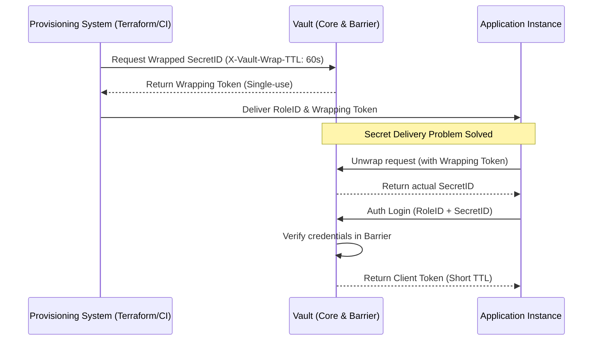

---
tags:
  - vault
  - security
  - auth
  - devops
  - architecture
date: 2026-08-08
aliases:
  - Advanced Vault Auth
  - JWT OIDC AppRole Guide
status: reference
---

# Управление идентичностью в HashiCorp Vault: От федеративного доверия до AppRole

> [!abstract] Краткое содержание
> Глубокий разбор механизмов аутентификации в HashiCorp Vault: архитектура JWT/OIDC интеграций для облачных и CI/CD сред, защита процесса доставки секретов через AppRole и Response Wrapping, а также принципы минимизации радиуса поражения (Blast Radius) в рамках концепции Zero Trust.

---

## 1. Введение: Концепция Auth Methods как шлюза идентичности

В современной архитектуре безопасности HashiCorp Vault выступает не просто как хранилище, а как стратегический **«брокер доверия» (*trust broker*)**. Его задача — транслировать внешнюю идентичность (будь то человек, облачный инстанс или CI/CD пайплайн) во внутреннюю систему разрешений. Vault делегирует проверку подлинности доверенным внешним провайдерам (Identity Providers), выступая связующим звеном между ними и ресурсами.

Для понимания архитектуры крайне важно различать два этапа:
* **Аутентификация (AuthN):** Ответ на вопрос «Кто ты?». Внешний субъект предъявляет доказательства идентичности бэкенду Vault.
* **Авторизация (AuthZ):** Ответ на вопрос «Что тебе разрешено?». Vault сопоставляет проверенную идентичность с политиками (Policies).

С точки зрения внутренних механизмов, после успешной проверки подлинности запрос передается в Vault Core. Внутри криптографического барьера (**Vault Barrier**) ядро генерирует токен, защищенный мастер-ключом, и сопоставляет его с соответствующими ACL.

> [!abstract] Жизненный цикл доступа
> Внешний запрос $\rightarrow$ Auth Method (Валидация у провайдера) $\rightarrow$ Identity (Маппинг сущности) $\rightarrow$ Vault Core (Генерация токена внутри Barrier) $\rightarrow$ Policy Mapping $\rightarrow$ Client Token (TTL).

Для автоматизированных систем, где исключен человеческий фактор, применяются методы JWT/OIDC и AppRole, устраняющие необходимость в использовании долгоживущих паролей.

---

## 2. Глубокое погружение: JWT / OIDC Auth Method

Методы JWT и OIDC являются золотым стандартом для облачных инфраструктур и CI/CD (GitLab, GitHub Actions). Они строятся на принципе транзитивного доверия: мы доверяем платформе (например, GitLab) подтверждать идентичность запущенного задания, а Vault переводит это подтверждение в краткосрочный токен.

### Технический механизм: Валидация подписи
Vault не хранит учетные данные внешних систем. Вместо этого он выполняет валидацию подписи токена через **JWKS (JSON Web Key Set)**. Провайдер подписывает JWT своим приватным ключом, а Vault проверяет его с помощью публичного ключа провайдера, доступного по сети.

### Слой "So What?": Анализ Claims
Архитектурная ценность метода заключается в проверке *claims* (утверждений), что позволяет реализовать принцип наименьших привилегий (Least Privilege):
* **`iss` (issuer):** Гарантирует, что токен пришел от доверенного инстанса.
* **`aud` (audience):** Ограничивает область использования токена только вашим Vault.
* **`sub` (subject) или кастомные поля (`project_id`, `ref`):** Позволяют выдавать разные права для разных веток или проектов. Например, доступ к `prod`-секретам получит только пайплайн из ветки `main`.

### Пример настройки роли для GitLab CI/CD:
```bash
vault write auth/jwt/role/my-app-prod \
    role_type="jwt" \
    bound_audiences="[https://vault.internal](https://vault.internal)" \
    user_claim="project_path" \
    bound_claims='{"project_id": "999", "ref": "master", "ref_type": "branch"}' \
    policies="app-prod-policy" \
    ttl="30m"

```

> [!tip] Бесшовные секреты
> JWT позволяет пайплайнам получать секреты «на лету». Это избавляет от необходимости вручную прописывать статические токены Vault в переменные окружения CI-системы, что само по себе является зоной риска.

---

## 3. Архитектурный паттерн: AppRole Auth Method

В средах, где отсутствует нативный облачный провайдер идентичности (например, локальные ЦОД или M2M взаимодействие внутри закрытых сегментов), стандартом является AppRole.

### Механика и «Проблема первого секрета»

AppRole использует связку **RoleID** (аналог логина, часто статический) и **SecretID** (аналог пароля, динамический). Здесь возникает *Secret Delivery Problem* — парадокс «курицы и яйца»: как безопасно доставить первый секрет приложению, чтобы оно могло аутентифицироваться и получить доступ к остальным секретам?

### Слой "So What?": Cubbyhole и Response Wrapping

Для решения этой проблемы Vault использует механизм **Response Wrapping** через временное хранилище **Cubbyhole**.

1. При генерации SecretID Vault не возвращает его в открытом виде. Вместо этого он создает одноразовый **Wrapping Token**.
2. Этот токен — лишь указатель на путь `sys/wrapping/unwrap`, который временно живет в памяти Cubbyhole.
3. Секрет никогда не записывается на диск в открытом виде и не светится в логах системы доставки.

Это обеспечивает критически важную детектируемость: если злоумышленник перехватит и использует Wrapping Token раньше приложения, операция *unwrap* для приложения завершится ошибкой. В архитектуре Zero Trust это служит немедленным триггером для отзыва всей роли.

> [!warning] Компрометация SecretID
> SecretID — это эквивалент пароля. Его компрометация до использования позволяет злоумышленнику полностью имитировать приложение. Использование Response Wrapping является обязательным для минимизации этого риска.

---

## 4. Визуализация потоков аутентификации (AppRole + Wrapping)

Ниже представлена диаграмма последовательности процесса безопасного получения доступа для автоматизированного приложения.



---

## 5. Архитектурный анализ: Минимизация «Радиуса поражения» (Blast Radius)

Переход от статических паролей к динамической аутентификации (JWT/AppRole) — это фундамент реализации концепции Zero Trust в инфраструктуре.

* **Динамичность vs Статика:** В отличие от вечных токенов, учетные данные в JWT и AppRole имеют ограниченный TTL. Это минимизирует временное окно, в течение которого злоумышленник может использовать украденный секрет.
* **Автоматический отзыв (Revocation):** Механизм аренды (*Lease*) гарантирует, что доступ закроется автоматически.
* **Изоляция и гранулярный аудит:** Поскольку каждый инстанс или пайплайн получает уникальный токен на основе своих атрибутов (claims или уникальный SecretID), *Audit Trail* позволяет точно идентифицировать скомпрометированный узел. Это делает невозможным незаметное горизонтальное перемещение (*Lateral Movement*) — злоумышленник не может использовать токен одного микросервиса для доступа к данным другого, не оставляя явных следов.

> [!note] Фундамент Zero Trust
> Продвинутая авторизация в Vault гарантирует, что мы не доверяем среде по умолчанию. Идентичность должна подтверждаться для каждой сессии, а доступ выдается на минимально необходимый срок.

---

## 6. Заключение и справочные команды

Интеграция Vault в каждый этап DevOps-пайплайна превращает безопасность из «заплатки» в прозрачный сервис. Управление этими процессами осуществляется через CLI, где настройка параметров времени жизни является ключевым инструментом контроля рисков.

### Ключевые команды управления Auth Methods

| Команда | Описание | Архитектурное значение |
| --- | --- | --- |
| `vault auth enable <method>` | Включить метод (`jwt`, `approle`, `kubernetes`). | Создание шлюза идентичности. |
| `vault auth list` | Список активных методов. | Инвентаризация векторов входа. |
| `vault auth tune -max-lease-ttl=1h <path>` | Настройка параметров метода. | Минимизация Blast Radius через ограничение TTL. |
| `vault auth help <method>` | Получить справку по API метода. | Документирование возможностей интеграции. |
| `vault auth disable <path>` | Деактивация метода. | Немедленный отзыв всех выданных токенов при инциденте. |

Использование федеративного доверия и защищенных механизмов доставки — единственный способ построить масштабируемую и безопасную систему в эпоху микросервисов и облачных вычислений.