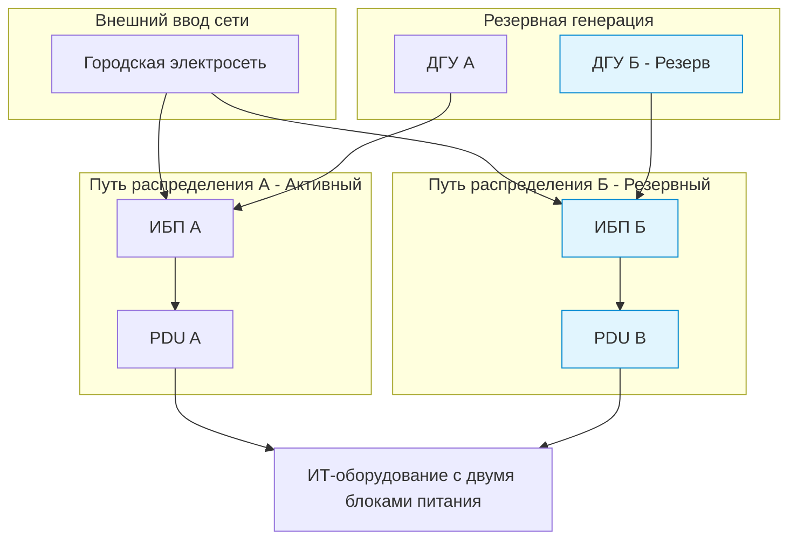

# Tier III Data Center (Uptime Institute)

**Tier III (Concurrently Maintainable / Параллельно обслуживаемый)** — это стандарт надежности инфраструктуры центра обработки данных (ЦОД), который позволяет проводить любые плановые ремонтные и регламентные работы без остановки ИТ-нагрузки.

> [!abstract] Ключевой принцип Tier III
> **Параллельное обслуживание (Concurrent Maintainability).** Любой компонент инженерных систем (дизель-генератор, ИБП, чиллер, трасса питания) может быть выведен из эксплуатации для обслуживания, тестирования или замены без прерывания работы серверов.

---

## 1. Метрики надежности Tier III

Доступность дата-центра рассчитывается на основе максимального допустимого времени простоя в год.

| Критерий | Значение стандарта Tier III |
| --- | --- |
| **Коэффициент доступности** | 99.982% |
| **Допустимый простой в год** | Не более 1.57 часа (94.6 минут) |
| **Схема резервирования** | Минимум $N+1$ |
| **Пути распределения** | 2 пути (1 активный, 1 резервный) |
| **ИТ-оборудование** | Обязательно с дублированными блоками питания (Dual-corded) |

---

## 2. Инженерные требования к инфраструктуре

### Электроснабжение

* **Двойной ввод:** Система распределения должна иметь как минимум два независимых пути (активный и резервный). Трассы кабелей физически разделяются, чтобы авария на одной линии не повредила вторую.
* **Резервное питание:** Дизель-генераторные установки (ДГУ) не ограничены по времени непрерывной работы (Continuous Rating) и способны нести полную нагрузку дата-центра при аварии на городской сети.
* **Автономия:** Запас топлива на объекте должен обеспечивать минимум 12 часов непрерывной работы ДГУ под полной нагрузкой.

### Хладоснабжение (Кондиционирование)

* Системы чиллеров, кондиционеров и трубопроводов резервируются по схеме $N+1$.
* Схема гидравлических контуров должна позволять изолировать любой участок трубы или кондиционер для ремонта, при этом оставшиеся мощности должны на 100% компенсировать тепловыделение серверных стоек.

---

## 3. Сравнение уровней Tier (Контекст)

Для понимания места Tier III в общей классификации Uptime Institute:

* **Tier I (Базовый):** Нет резервирования. Любая поломка или обслуживание железки останавливает весь ЦОД. Доступность: 99.671%.
* **Tier II (Компоненты с резервированием):** Резервируются только сами устройства ($N+1$ ИБП, $N+1$ кондиционеры), но пути распределения (трубы, кабели) одни. Обслуживание трасс требует остановки. Доступность: 99.741%.
* **Tier III (Параллельное обслуживание):** Резервируются и компоненты, и пути распределения. Плановые работы = 0 минут простоя. Внеплановые аварии (ошибки персонала, скрытые дефекты) могут вызвать сбой. Доступность: 99.982%.
* **Tier IV (Отказоустойчивый / Fault Tolerant):** Схема $2(N+1)$ или $2N$. Любая единичная авария (даже пожар в одном из залов) автоматически изолируется, система продолжает работать без участия человека. Доступность: 99.995%.

---

## 4. Разница между Плановым и Внеплановым событием

Концепция Tier III четко разделяет эти понятия:

> [!warning] Важное уточнение стандарта
> Tier III гарантирует защиту от простоев только при **плановом обслуживании**. Если происходит **внеплановое событие** (например, техник случайно перебил активный кабель питания, а на резервной линии в этот момент была скрытая поломка), дата-центр Tier III может временно отключиться. Автоматическая защита от абсолютно любых комбинаций аварий — это уже уровень Tier IV.