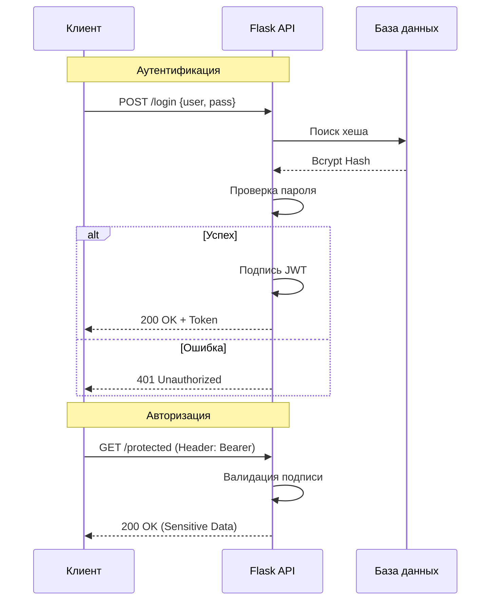

# Auth_Module

> [!ABSTRACT] Концепция
> Разграничение прав доступа — это стратегический фундамент безопасности API. Ошибка в понимании разницы между этими этапами ведет к критическим уязвимостям, таким как **IDOR** (Insecure Direct Object Reference) и **BOLA**.

---

## 1. 🏗 Теоретический фундамент: Триада ИБ

Разделение ответственности (Separation of Concerns) позволяет строить модульные системы, где каждый фильтр выполняет ровно одну задачу.

### Разбор понятий
1. **Identification (Идентификация):** Процесс заявления личности. Пользователь говорит: *"Я — @alex_architect"*. (Логин, Email).
2. **Authentication (Аутентификация):** Процесс доказательства личности. Система проверяет секрет (Пароль, OTP, биометрия).
3. **Authorization (Авторизация):** Процесс проверки полномочий. Имеет ли подтвержденный пользователь право на это действие? (Роли: Admin/User).

### Сравнительный анализ

| Критерий | Идентификация | Аутентификация | Авторизация |
| :--- | :--- | :--- | :--- |
| **Цель** | Заявить о личности | Подтвердить личность | Определить права |
| **Процесс** | Ввод логина | Проверка пароля/JWT | Проверка ролей/ACL |
| **Уязвимость** | Impersonation | Brute Force | [[IDOR]] / [[BOLA]] |

### 🛰 Механизм Authorization Header
Стандарт для REST API — заголовок `Authorization`.
**Формат:** `Authorization: <Type> <Credentials>`

* **Basic Auth:** `Basic Base64(user:pass)`. **Warning:** Только через HTTPS!
* **Bearer Token (JWT):** `Bearer <signed_token>`. Индустриальный стандарт.

> [!INFO] Жизненный цикл запроса
> Клиент → Заголовок Auth → Сервер → Валидация подписи → Извлечение Identity.

---

## 2. 🐍 Практическая реализация на Flask

Используем связку `Flask-JWT-Extended` + `Flask-Bcrypt`.

### Демонстрационный код
```python
import os
from flask import Flask, request, jsonify, make_response
from flask_jwt_extended import JWTManager, create_access_token, jwt_required
from flask_bcrypt import Bcrypt

bcrypt = Bcrypt()
jwt = JWTManager()

def create_app():
    app = Flask(__name__)
    
    # SECURITY: Ключи берем только из переменных окружения!
    app.config['JWT_SECRET_KEY'] = os.environ.get('JWT_SECRET_KEY', 'default_dev_key')
    
    bcrypt.init_app(app)
    jwt.init_app(app)

    # Имитация БД
    users_db = {
        "admin": bcrypt.generate_password_hash("secure_password").decode('utf-8')
    }

    @app.route('/login', methods=['POST'])
    def login():
        data = request.get_json()
        username, password = data.get('username'), data.get('password')

        user_hash = users_db.get(username)
        if username and user_hash and bcrypt.check_password_hash(user_hash, password):
            access_token = create_access_token(identity=username)
            return jsonify(access_token=access_token), 200

        return make_response(jsonify({"msg": "Bad credentials"}), 401)

    @app.route('/protected', methods=['GET'])
    @jwt_required() # Точка авторизации
    def protected():
        return jsonify(msg="Access granted"), 200

    return app
```

> [!CODE] Security Perspective
> - `bcrypt.check_password_hash`: Защищает от атак по времени.
> - `@jwt_required()`: Декларативная защита эндпоинта.

---

## 3. 📊 Визуализация взаимодействия




---

## 4. 🚀 Deep Dive: Архитектура и Best Practices
### Defense_in_Depth
1. **Blueprints:** Выносите логику аутентификации в `auth_blueprint.py`. Не загромождайте `app.py`.
2. **Bcrypt vs SHA:** Bcrypt использует адаптивную стоимость (work factor) и встроенную **соль**, что делает перебор на GPU неэффективным.
3. **JWT TTL:** Короткий срок жизни токена (`JWT_ACCESS_TOKEN_EXPIRES`) — лучшая защита от перехвата.
4. **Secrets Management:** Использование переменных окружения предотвращает утечку ключей через GitHub.

> [!SUCCESS] Резюме
> Безопасность — это не состояние, а процесс. Понимание триады ИБ превращает хаотичный код в надежную крепость.

---