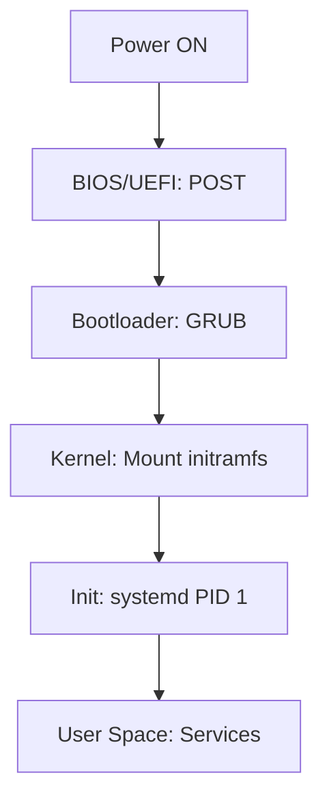

# Linux Deep Dive: Исчерпывающее руководство системного инженера

> [!abstract] Философия
> Мастерство системного архитектора заключается в способности видеть за командами терминала движение электронов и переключение контекста (**Context Switching**) на уровне процессора.

---

## Часть 1: Глубокое понимание системы (Under the Hood)

### 1. Архитектура ядра и системные абстракции
Ядро (Kernel) — привилегированный посредник между **Hardware** и **User Space**.

* **Кольца защиты:** Приложения работают в `Ring 3`, ядро в `Ring 0`. Переход осуществляется через **System Call**.
* **VFS (Virtual File System):** Реализация концепции "Всё есть файл".
* **Архитектура:** Монолитная с поддержкой динамических модулей (LKM).

### 2. Анатомия процесса загрузки (Boot Process)



#### Стадии загрузки и точки отказа
| Стадия | Ответственный | Точка отказа | Примечание архитектора |
| :--- | :--- | :--- | :--- |
| **Инициализация** | BIOS/UEFI | HW Failure | Сбой на уровне «железа» или NVRAM. |
| **Загрузчик** | GRUB | Missing /boot | Ошибки в `grub.cfg` или MBR/EFI. |
| **Ядро** | Kernel | Kernel Panic | Параметры загрузки или драйверы в initramfs. |
| **Инициализация ОС** | systemd | Dependency Hell | Неверный `/etc/fstab` или зависимости. |

### 3. Управление памятью и хранилищем
* **Виртуальная память:** Изоляция процессов через таблицы страниц.
* **Inodes:** * `Hard Links`: Дополнительные имена для одного inode.
    * `Symbolic Links`: Указатели на пути (работают между FS).

> [!warning] Critical Path
> Ошибка в `/etc/fstab` — самая частая причина перехода системы в **Emergency Mode**. Всегда проверяй монтирование через `mount -a` перед ребутом.

---

## Часть 2: Мастерство командной строки

### 4. Философия Bash и потоки данных
Терминал — это не просто ввод текста, а управление дескрипторами файлов:
* `0`: stdin
* `1`: stdout
* `2`: stderr

> [!info] Архитектурный факт
> **Pipelines (|)** создают анонимные каналы в памяти ядра. Данные передаются между процессами без записи на диск.

### 5. Сравнение методов компрессии
| Метод | Команда | Эффективность | Скорость | Контекст |
| :--- | :--- | :--- | :--- | :--- |
| **Gzip** | `gzip` | Низкая | Очень высокая | Логи в реальном времени |
| **Bzip2** | `bzip2` | Высокая | Средняя | Средние архивы |
| **XZ** | `xz` | Максимальная | Низкая | Дистрибутивы и бэкапы |

### 6. Модель разрешений и SUID
Безопасность базируется на битах прав: `rwx`.

* **SUID (Set User ID):** Запуск от имени владельца (пример: `/usr/bin/passwd`).
* **SGID:** Наследование группы директории.
* **Sticky Bit:** Запрет удаления чужих файлов (пример: `/tmp`).

---

## Часть 3: Практикум и Автоматизация

### Золотой свод Bash-скриптинга (Best Practices)
Используй "Строгий режим" для всех DevOps скриптов:

```bash
#!/bin/bash
set -euo pipefail
# -e: выход при ошибке
# -u: ошибка при пустой переменной
# -o pipefail: ловить ошибки внутри пайпов
```

> [!example] Pro-Tip: ISC-DHCP-Server
> Если служба не стартует, проверь `/var/run/`. Известный баг иногда создает конфликтный PID-файл, блокирующий процесс. Удаляй его вручную:
> `rm /var/run/dhcpd.pid`