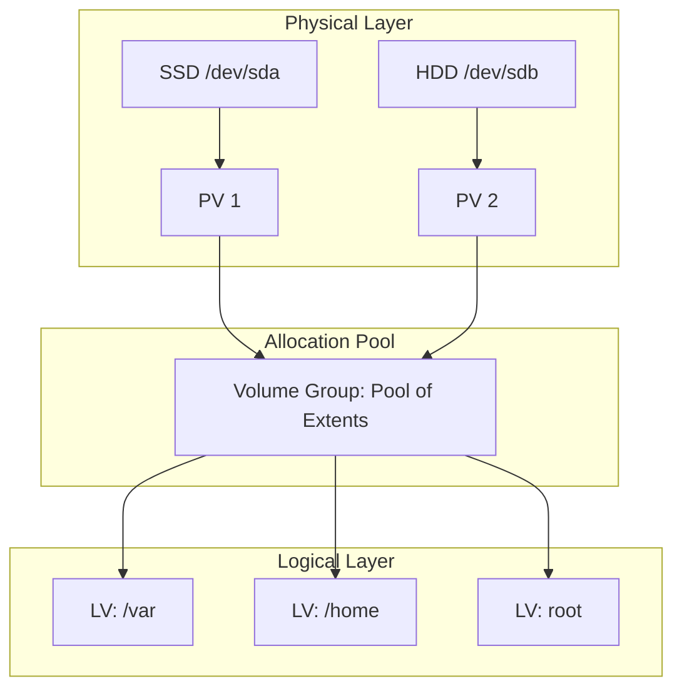

# 🧊 Глубокое погружение в LVM: Архитектура и гибкость

> [!abstract] Суть технологии
> **LVM (Logical Volume Manager)** — это слой абстракции между физическими дисками и файловой системой. Он превращает хранилище из набора «жестких коробок» (разделов) в «эластичное облако» ресурсов.

---

## 1. Архитектурный «Сэндвич» 🧱

В основе LVM лежит квантование данных на **Physical Extents (PE)** — блоки (обычно по 4 МБ).



### Иерархия уровней
* **PV (Physical Volume):** Физический фундамент. Устройство с областью метаданных.
* **VG (Volume Group):** Виртуальный пул, объединяющий все PE.
* **LV (Logical Volume):** Результат отображения (mapping) логических блоков на физические. Именно здесь живет ФС.


### Сравнение: Разделы vs LVM
| Критерий | Стандартные разделы | Логические тома (LVM) |
| :--- | :--- | :--- |
| **Масштабирование** | Статичное | Динамическое (Online-resize) |
| **Объединение носителей** | Только через RAID | Нативно через VG |
| **Бэкап** | Полное копирование | Снимки (Snapshots) |

---

## 2. Сценарий «Hot-Resize» 🔥

Кейс: Раздел `/var` переполнен, нужно добавить 20 ГБ с нового SSD без остановки системы.

> [!example] Алгоритм действий
> 1. **Инициализация:** `pvcreate /dev/sdb`
> 2. **Расширение пула:** `vgextend vg_system /dev/sdb`
> 3. **Увеличение LV и ФС:** `lvextend -r -L +20G /dev/vg_system/lv_var`

**Важное замечание по ФС:**
* **Ext4:** Использует `resize2fs` (автоматически при `-r`).
* **XFS:** Требует `xfs_growfs /point/mount` (указывается точка монтирования, а не устройство).

---

## 3. Продвинутые фишки 🪄

### Copy-on-Write (CoW) Snapshots
LVM не копирует данные при создании снимка. Он фиксирует только изменения.
* **Зачем:** Страховка перед обновлением ядра или критического ПО.
* **Риск:** Если место под снимок закончится, он будет «отравлен» (invalidated).

### Thin Provisioning
Концепция **Storage-as-a-Service**. Позволяет выделить 1 ТБ виртуального места, имея физически лишь 100 ГБ. Место тратится только по мере реальной записи.


---

## 4. Безопасность и ошибки ⚠️

> [!warning] LVM — это НЕ RAID
> Если VG объединяет два диска без зеркалирования (RAID), выход из строя одного PV уничтожит **всю** группу томов.

**Топ-3 ошибки новичков:**
1.  Отсутствие избыточности (нужен RAID под PV).
2.  «Забытые» снимки (замедляют IOPS и съедают место).
3.  Игнорирование выравнивания PE на 4Kn дисках.

---

## 5. Лабораторная: Песочница 🧪

Если нет лишних дисков, используй **loop-устройства**:

```bash
# Создаем файл-пустышку на 1ГБ
dd if=/dev/zero of=/tmp/lvm_disk.img bs=1M count=1024

# Превращаем его в петлевое устройство
losetup /dev/loop10 /tmp/lvm_disk.img

# Дальше работаем как с обычным диском
pvcreate /dev/loop10
vgcreate lab_vg /dev/loop10
lvcreate -L 500M -n lab_lv lab_vg
```

---

## ❓ Вопросы для самопроверки
1. Что такое **Physical Extent** и каков его стандартный размер?
2. В чем разница между `lvextend` и `resize2fs`?
3. Где LVM хранит бэкапы своих метаданных? (Ответ: `/etc/lvm/backup`)