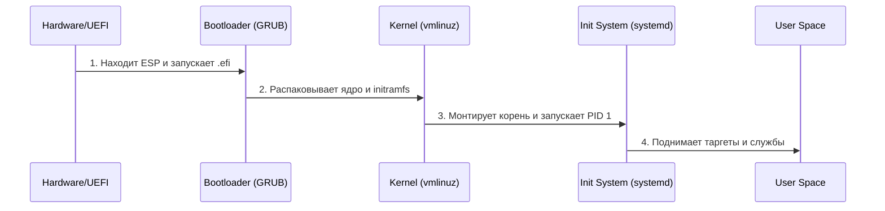

# 🚀 Путешествие байта: от кнопки питания до терминала

> [!abstract] О чем эта лекция
> Глубокое погружение в вертикаль Linux: от «искры» в кремнии до полноценного рабочего окружения. Разбираем, как слои абстракции накладываются друг на друга.

---

## 🏗 Общая схема загрузки (Sequence Diagram)

---

## 1. Hardware & Firmware (The Spark) ⚡
Путешествие начинается с физики. Процессор — это чистый лист, пока не подан сигнал.

* **Сигнал POWER_GOOD:** Стабилизация напряжения БП.
* **POST (Power-On Self-Test):** Опрос «железа» (RAM, GPU, CPU).
* **UEFI/BIOS:** Поиск загрузочного раздела (ESP) или 512 байт MBR.

> [!quote] Аналогия
> Это как утренняя зарядка: вы просыпаетесь (питание), проверяете, на месте ли руки-ноги (POST), и ищете тапочки (загрузочное устройство).

**Key Takeaway:** Firmware — фундамент, который приводит железо в чувство.

---

## 2. The Bootloader (The Map) 🗺️
Управление переходит к **GRUB 2** или **systemd-boot**.

* **vmlinuz:** Сжатое ядро (буква `z` — символ компрессии).
* **initramfs:** Временная файловая система в RAM. Решает проблему «курицы и яйца»: нужны драйверы, чтобы прочитать диск, на котором лежат драйверы.

> [!info] Зачем это нужно?
> Загрузчик — навигатор, который знает, где лежит «мозг» системы.

---

## 3. The Kernel (The Brain) 🧠
Ядро работает в **Ring 0** (режим бога) с полным доступом к ресурсам.

1. **Инициализация:** Проверка шин и устройств.
2. **pivot_root:** Магический трюк — замена временной `initramfs` на реальный корневой раздел `/`.
3. **PID 1:** Запуск первого процесса в User Space (обычно `systemd`).

---

## 4. User Space & Init System (The Manager) 💼
Все, что выше PID 1 — пространство пользователя.

* **systemd:** Не просто «запускалка», а менеджер зависимостей. Строит граф и запускает всё параллельно.
* **Units & Targets:** * `multi-user.target` — консоль + сеть.
	* `graphical.target` — графика.

---

## 5. Environment & Graphics (The Face) 🎨
Система «надевает лицо».

* **TTY/Login:** Ожидание ввода пользователя.
* **Display Manager:** GDM/SDDM — окно логина.
* **Xorg vs Wayland:** Выбор протокола отрисовки.
* **DE (Desktop Environment):** Оболочка (GNOME, KDE, Hyprland).

---

## 6. Filesystem Hierarchy (The House) 🏠
Философия **«Everything is a file»**.

| Путь | Назначение |
| :--- | :--- |
| `/etc` | Конфиги (твоё «настроечное» депо) |
| `/var` | Динамические данные (логи, кэш) |
| `/proc` | Виртуальное окно в состояние ядра |
| `/sys` | Интерфейс управления «железом» |

---

## ❓ Каверзные вопросы для проверки

> [!question] Почему ядро называют «лжецом»?
> Оно создает иллюзию для каждой программы, что та владеет всей памятью целиком (виртуальная память).

> [!question] Что будет, если не найти `/sbin/init`?
> Произойдет **Kernel Panic**, так как ядро не может делегировать управление пользователю.

> [!example] Сложный вопрос на засыпку
> Можно ли создать жесткую ссылку между разными дисками? 
> **Ответ:** Нет, `inode` уникален только внутри одной файловой системы.