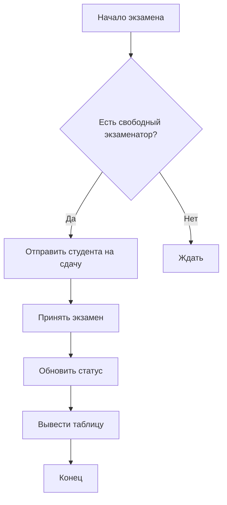
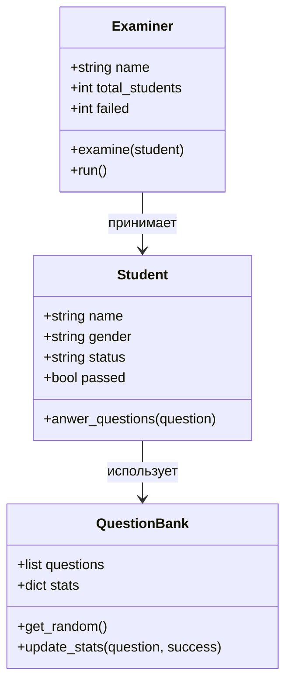
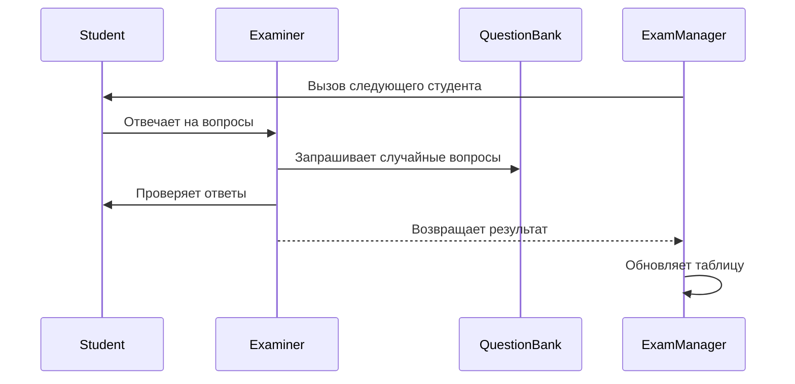

# Задания второго дня
## Экзамен
### Цель проекта
Смоделировать процесс сдачи экзамена, в котором:
- Несколько **экзаменаторов** принимают студентов одновременно;
- Студенты стоят в **общей очереди**;
- После освобождения экзаменатора следующий студент заходит автоматически;
- Учитываются **вероятности, настроение экзаменатора, золотое сечение**, и **время экзамена**;
- Программа **в реальном времени** показывает прогресс экзамена и **создаёт финальный отчёт** с анализом.

### Логика

### Классавая диограма

## Диаграмма взаимодействий

## Диаграмма времени

```mermaid
gantt
    dateFormat  HH:mm:ss
    title Процесс экзамена
    section Экзаменатор Степан
    Приём студентов     :done, 00:00:00, 00:00:30
    Обед                :active, 00:00:30, 00:00:48
    Возобновление работы: 00:00:48, 00:01:15
```

